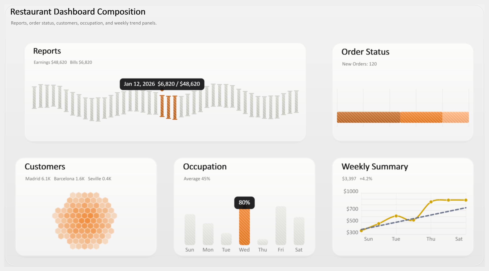
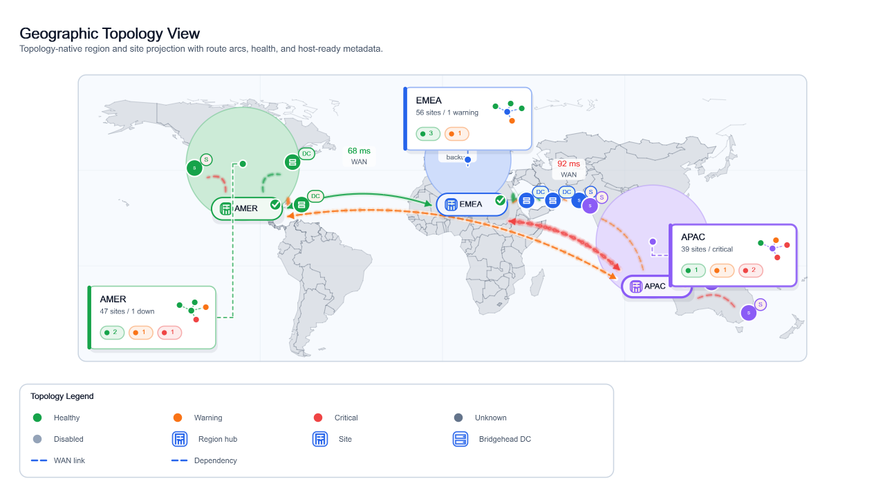
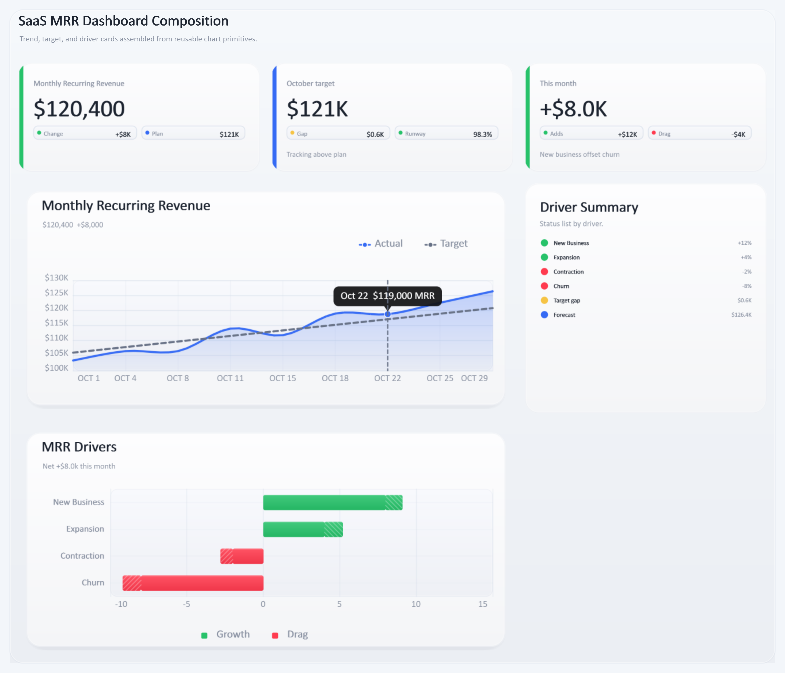
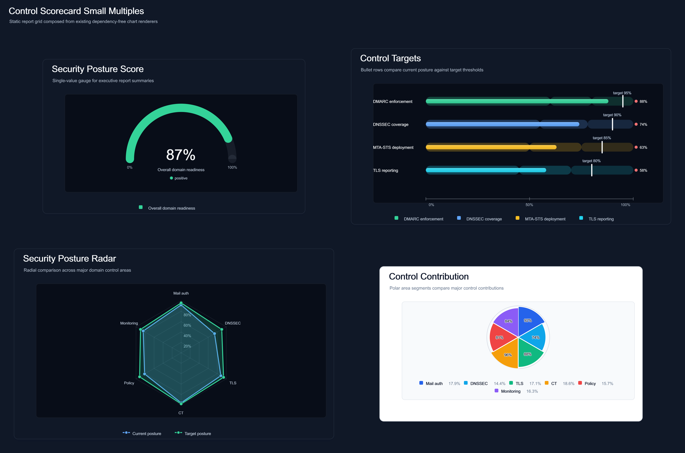
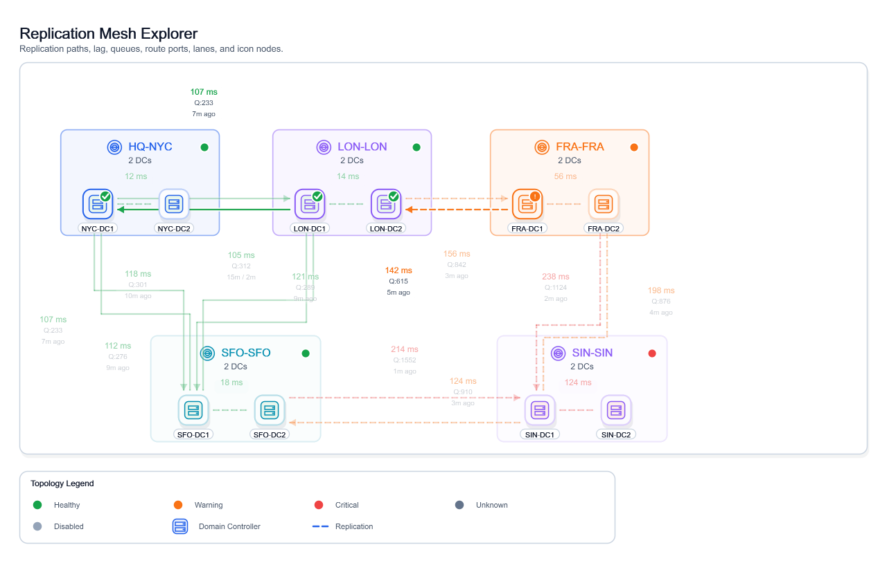
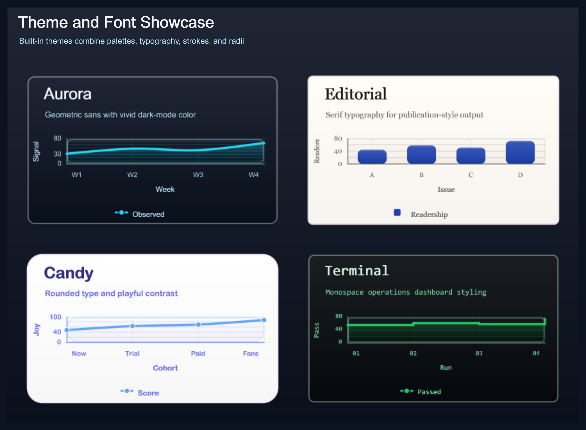

# ChartForgeX - Dependency-Free Chart Rendering for .NET

ChartForgeX renders polished charts, visual blocks, topology diagrams, and static report visuals from .NET without adding runtime chart dependencies to generated output.

## NuGet Package

[](https://www.nuget.org/packages/ChartForgeX)
[](https://www.nuget.org/packages/ChartForgeX)

## Project Information

[](https://github.com/EvotecIT/ChartForgeX)
[](https://github.com/EvotecIT/ChartForgeX)
[](https://github.com/EvotecIT/ChartForgeX/actions/workflows/quality.yml)

## Author & Social

[](https://twitter.com/PrzemyslawKlys)
[](https://evotec.xyz/hub)
[](https://www.linkedin.com/in/pklys)
[](https://www.threads.net/@przemyslaw.klys)
[](https://evo.yt/discord)

## What It Does

ChartForgeX turns .NET data into deterministic static visuals: charts, chart grids, visual blocks, visual canvases, topology diagrams, and map-backed report graphics. It is meant for generated reports, documentation, email, static websites, dashboards, wallpapers, social preview images, Office-style generators, and other hosts that need polished output without a JavaScript chart dependency.

The core package renders SVG, script-free static HTML, PNG, GIF, JPEG, BMP, PPM, and TIFF without runtime package dependencies. Optional browser behavior lives in adapter packages, so a static report can stay static while a dashboard can opt into tooltips, selection, zoom, pan, brush ranges, synchronized charts, and export controls.

## Visual Tour

These are generated artifacts from `ChartForgeX.Examples`, checked into the project site assets beside their matching HTML, SVG, PNG, and source snippets. HTML links open through the Evotec preview service so readers see the rendered page instead of GitHub's source view; SVG and PNG links stay pointed at the checked-in artifacts.

<table>
  <tr>
    <td width="50%">
      <a href="https://preview.evotec.xyz/?url=https://github.com/EvotecIT/ChartForgeX/blob/main/Website/static/examples/generated/dashboard-restaurant-overview-grid.html">
        
      </a>
      <br />
      <strong>Dashboard composition</strong>
      <br />
      KPI cards, sparklines, occupancy blocks, hexbin summaries, and status panels in one static report surface.
      <br />
      <a href="https://preview.evotec.xyz/?url=https://github.com/EvotecIT/ChartForgeX/blob/main/Website/static/examples/generated/dashboard-restaurant-overview-grid.html">HTML</a> /
      <a href="Website/static/examples/generated/dashboard-restaurant-overview-grid.svg">SVG</a> /
      <a href="Website/static/examples/generated/dashboard-restaurant-overview-grid.png">PNG</a>
    </td>
    <td width="50%">
      <a href="https://preview.evotec.xyz/?url=https://github.com/EvotecIT/ChartForgeX/blob/main/Website/static/examples/generated/visual-geographic-topology-map.html">
        
      </a>
      <br />
      <strong>Topology and geography</strong>
      <br />
      Product-neutral topology models with map projection, route arcs, callouts, legends, and SVG metadata hooks.
      <br />
      <a href="https://preview.evotec.xyz/?url=https://github.com/EvotecIT/ChartForgeX/blob/main/Website/static/examples/generated/visual-geographic-topology-map.html">HTML</a> /
      <a href="Website/static/examples/generated/visual-geographic-topology-map.svg">SVG</a> /
      <a href="Website/static/examples/generated/visual-geographic-topology-map.png">PNG</a>
    </td>
  </tr>
  <tr>
    <td width="50%">
      <a href="https://preview.evotec.xyz/?url=https://github.com/EvotecIT/ChartForgeX/blob/main/Website/static/examples/generated/dashboard-saas-mrr-grid.html">
        
      </a>
      <br />
      <strong>Operational dashboard grids</strong>
      <br />
      Trend cards, driver summaries, waterfall bars, line charts, and metric panels in a reusable grid model.
      <br />
      <a href="https://preview.evotec.xyz/?url=https://github.com/EvotecIT/ChartForgeX/blob/main/Website/static/examples/generated/dashboard-saas-mrr-grid.html">HTML</a> /
      <a href="Website/static/examples/generated/dashboard-saas-mrr-grid.svg">SVG</a> /
      <a href="Website/static/examples/generated/dashboard-saas-mrr-grid.png">PNG</a>
    </td>
    <td width="50%">
      <a href="https://preview.evotec.xyz/?url=https://github.com/EvotecIT/ChartForgeX/blob/main/Website/static/examples/generated/control-scorecards-grid.html">
        
      </a>
      <br />
      <strong>Report-ready small multiples</strong>
      <br />
      Gauges, bullets, radar charts, polar areas, and shared themes rendered without a browser runtime.
      <br />
      <a href="https://preview.evotec.xyz/?url=https://github.com/EvotecIT/ChartForgeX/blob/main/Website/static/examples/generated/control-scorecards-grid.html">HTML</a> /
      <a href="Website/static/examples/generated/control-scorecards-grid.svg">SVG</a> /
      <a href="Website/static/examples/generated/control-scorecards-grid.png">PNG</a>
    </td>
  </tr>
  <tr>
    <td width="50%">
      <a href="https://preview.evotec.xyz/?url=https://github.com/EvotecIT/ChartForgeX/blob/main/Website/static/examples/generated/visual-replication-mesh-explorer.html">
        
      </a>
      <br />
      <strong>Interactive topology scenarios</strong>
      <br />
      Grouped nodes, routed edges, status encoding, scenario switching, route playback, and scoped URL state.
      <br />
      <a href="https://preview.evotec.xyz/?url=https://github.com/EvotecIT/ChartForgeX/blob/main/Website/static/examples/generated/visual-replication-mesh-explorer.html">HTML</a> /
      <a href="Website/static/examples/generated/visual-replication-mesh-explorer.svg">SVG</a> /
      <a href="Website/static/examples/generated/visual-replication-mesh-explorer.png">PNG</a>
    </td>
    <td width="50%">
      <a href="https://preview.evotec.xyz/?url=https://github.com/EvotecIT/ChartForgeX/blob/main/Website/static/examples/generated/theme-font-showcase-grid.html">
        
      </a>
      <br />
      <strong>Visual systems</strong>
      <br />
      Themes, palettes, typography, brand treatments, and consistent SVG/PNG styling from the same chart model.
      <br />
      <a href="https://preview.evotec.xyz/?url=https://github.com/EvotecIT/ChartForgeX/blob/main/Website/static/examples/generated/theme-font-showcase-grid.html">HTML</a> /
      <a href="Website/static/examples/generated/theme-font-showcase-grid.svg">SVG</a> /
      <a href="Website/static/examples/generated/theme-font-showcase-grid.png">PNG</a>
    </td>
  </tr>
</table>

More generated examples are available in the checked-in [catalog](https://preview.evotec.xyz/?url=https://github.com/EvotecIT/ChartForgeX/blob/main/Website/static/examples/generated/catalog.html), [topology demo hub](https://preview.evotec.xyz/?url=https://github.com/EvotecIT/ChartForgeX/blob/main/Website/static/examples/generated/topology-demo.html), [SVG/PNG comparison view](https://preview.evotec.xyz/?url=https://github.com/EvotecIT/ChartForgeX/blob/main/Website/static/examples/generated/svg-png-comparison.html), and [quality dashboard](https://preview.evotec.xyz/?url=https://github.com/EvotecIT/ChartForgeX/blob/main/Website/static/examples/generated/quality-dashboard.html).

## Examples

Run the example project when changing renderers, themes, chart APIs, or gallery metadata:

```powershell
dotnet run --project .\ChartForgeX.Examples\ChartForgeX.Examples.csproj -c Release
```

Generated output is written to `ChartForgeX.Examples/bin/Release/net8.0/output/`.

Useful review entry points:

- `index.html` - full generated gallery.
- `catalog.html` - examples grouped by chart family.
- `topology-demo.html` - focused topology demo hub with the scenario route explorer.
- `global-estate-premium-topology.html` - image-backed hierarchy with badges, secondary labels, status overlays, nested clusters, and drill navigation.
- `graph-2000-interactive.html` plus `graph-2000-stage-01-overview.*` through `graph-2000-stage-05-full.*` - one 2,001-object hierarchy as an interactive WebGL/Barnes-Hut explorer and deterministic static report stages.
- `enterprise-access-graph-benchmark.html` - accelerated graph explorer benchmark with 360 nodes, 720 directed edges, compact-document rendering, drag, pan, zoom, LOD, and telemetry.
- `svg-png-comparison.html` - side-by-side renderer parity review.
- `quality-dashboard.html` - visual health summary.

Example cards link HTML, SVG, PNG, and C# snippets when a checked source sample exists.

For explicit 1k, 5k, and 10k browser scale fixtures, run:

```powershell
dotnet run --project .\ChartForgeX.Examples\ChartForgeX.Examples.csproj -c Release -- --graph-scale-only
```

## Install

```powershell
dotnet add package ChartForgeX
```

ChartForgeX targets `net472`, `netstandard2.0`, `net8.0`, and `net10.0`. The core package has no runtime package dependencies. The `net472` target uses `Microsoft.NETFramework.ReferenceAssemblies.net472` as a private build-time reference only.

Optional visual artifact, markup, Mermaid, and interaction support is split into separate packages:

| Package | Purpose |
| --- | --- |
| `ChartForgeX` | Static SVG, HTML, PNG, GIF, JPEG, BMP, PPM, and TIFF rendering. |
| `ChartForgeX.Mermaid` | Source-preserving Mermaid parser with first-class flowchart, sequence, class, state, ER, requirement, architecture, C4, git graph, block, packet, Venn, Ishikawa, Wardley, mindmap, tree view, event modeling, kanban, pie, journey, timeline, quadrant, Gantt, XY chart, Sankey, radar, and treemap rendering. |
| `ChartForgeX.Markup` | Markdown-friendly v1 ChartForgeX visual fences for chart, timeline, topology, flow, sequence, and table artifacts. |
| `ChartForgeX.Markup.Mermaid` | Thin optional bridge that lets `ChartForgeX.Markup` parse Mermaid fences through `ChartForgeX.Mermaid`. |
| `ChartForgeX.Interactivity` | Host-neutral interaction contracts. |
| `ChartForgeX.Interactivity.Html` | Self-contained chart and topology interaction adapter, including interactive topology pages, the stencil browser, and the graph explorer with SVG, Canvas, WebGL, hierarchy navigation, compact large-scene documents, and atomic runtime updates. |

The core package also includes product-neutral visual artifact models for reusable visuals. `Chart` models can be wrapped as artifacts, `FlowArtifact` keeps authored process flows distinct from topology previews, `SequenceArtifact` models interaction diagrams, `TableArtifact` declares capabilities such as search, sort, filter, selection, copy, export, and virtualization, and static previews render deterministically from the core package. Rich interaction belongs in native hosts and adapter packages. See `docs/visual-artifacts.md`, `docs/markup.md`, `docs/markup-v1-reference.md`, and `docs/mermaid.md` for the current contracts.

## Native AOT and Trimming

ChartForgeX is designed to work in trimmed and Native AOT applications on modern .NET targets. The `net8.0` and `net10.0` package assets declare AOT compatibility, enable trim/single-file/AOT analyzers, and avoid reflection-driven serialization or dynamic code paths in the rendering surface.

The release quality loop publishes and runs `ChartForgeX.AotSmoke` as a Native AOT executable. That smoke app renders SVG, static HTML, PNG, chart grids, visual blocks, topology diagrams, and the self-contained HTML interaction adapter, so AOT regressions fail before a package is published.

## Output API

The output API follows one rule: `To*` returns content, `Save*` writes a file, and `Write*` streams bytes.

| Need | Use |
| --- | --- |
| SVG markup | `chart.ToSvg()` or `chart.SaveSvg("chart.svg")` |
| Static HTML | `chart.ToHtmlFragment()`, `chart.ToHtmlPage()`, or `chart.SaveHtml("chart.html")` |
| Interactive topology HTML | `topology.ToInteractiveHtmlFragment()`, `topology.ToInteractiveHtmlPage()`, or `topology.SaveInteractiveHtml("topology.html")` from `ChartForgeX.Interactivity.Html` |
| PNG bytes/file | `chart.ToPng()` or `chart.SavePng("chart.png")` |
| Layered visual canvas | `VisualCanvas.CreateSocialPreview()`, `VisualCanvas.CreateDesktopWallpaper()`, `canvas.ToSvg()`, `canvas.SavePng("social-preview.png")`, or `canvas.Save("social-preview.jpg", rasterOptions)` for fixed-size wallpaper, social image, report cover, and hero compositions |
| Reusable image composition | `ImageComposition.FromFile("wallpaper.jpg").DrawImage(...).DrawText(...).StrokeRectangle(...).Save("wallpaper-output.jpg")`, `composition.Write(stream, RasterImageFormat.Png)`, or `ImageComposition.TryFromBytes(...)` for dependency-free background plus overlay generation |
| Topology animated raster | `topology.ToGif(options)`, `topology.ToApng(options)`, `topology.WriteGif(stream, options)`, `topology.WriteApng(stream, options)`, `topology.SaveGif("route.gif", options)`, or `topology.SaveApng("route.apng", options)` with `TopologyMotionOptions.RoutePulseForScenario(...)` or `.RoutePulseForEdges(...)` |
| Extension-inferred file output | `chart.Save("chart.svg")`, `chart.Save("chart.html")`, `chart.Save("chart.png")`, `chart.Save("chart.gif")`, `chart.Save("chart.jpg")`, `chart.Save("chart.tiff")`; topology also supports animated `topology.Save("route.gif", options)` and `topology.Save("route.apng", options)` |
| Advanced raster output | `ToRasterImage`, `WriteRasterImage`, and `SaveRasterImage` for PNG, GIF, JPEG, BMP, PPM, and TIFF; plus format helpers such as `ToBmp`, `ToPpm`, and `ToTiff` |

`Save(path)` infers `.svg`, `.html`, `.htm`, `.png`, `.gif`, `.jpg`, `.jpeg`, `.bmp`, `.ppm`, `.tiff`, and `.tif`. Topology `Save(path, options)` also infers animated `.gif` and `.apng` when `TopologyMotionOptions` describes a route. Animated GIF output uses an adaptive palette, error diffusion, and cropped delta frames for compatibility-friendly previews. APNG keeps full RGBA color and also crops unchanged frame regions for high-fidelity animated raster output, while SVG remains the highest-fidelity script-free animated surface. Unsupported or empty extensions fail before a file is opened. `RasterImageOptions` controls JPEG quality, PNG compression level, and the background used when alpha must be flattened.

## Typed Data, Axes, and Facets

ChartForgeX has one chart construction surface. Hosts can keep their own records, transform them through immutable `ChartDataset<T>` values, and map them directly into native charts without maintaining a second set of chart DTOs.

```csharp
using ChartForgeX.Core;
using ChartForgeX.Data;

var samples = ChartDataset<CpuSample>.From(new[] {
    new CpuSample("Warsaw", 1, 35),
    new CpuSample("Warsaw", 2, 42),
    new CpuSample("London", 1, 48),
    new CpuSample("London", 2, 61)
});

var report = ChartGrid.FromFacets(
    samples,
    sample => sample.Site,
    (site, rows) => Chart.Create()
        .WithTitle(site)
        .WithYAxis("CPU (%)")
        .ConfigureYAxis(axis => axis.WithBounds(0, 100))
        .AddLine("CPU", rows, sample => sample.Minute, sample => sample.Cpu),
    columns: 2);

report.SavePng("cpu-by-site.png");
report.SaveSvg("cpu-by-site.svg");

record CpuSample(string Site, double Minute, double Cpu);
```

`ChartAxis` owns bounds, tick count, label density, formatting, and `Linear`, `Logarithmic`, `SymmetricLogarithmic`, `Time`, `Category`, or `Band` scaling. Direct helpers such as `ChartPoints.FromValues(...)` and `ChartBubbles.FromXYSize(...)` remain available when a typed data pipeline is unnecessary.

## Project Status

The ChartForgeX 1.0 surface uses one typed construction, typography, geometry, direction, and layout vocabulary. Pre-release duplicate APIs have been removed; see the [1.0 migration guide](docs/1.0-migration.md) for intentional breaking changes. Active follow-up work belongs in `TODO.md`; release notes belong in GitHub Releases and short NuGet package notes.

## Quick Start

```csharp
using ChartForgeX;
using ChartForgeX.Core;
using ChartForgeX.Primitives;
using ChartForgeX.Themes;

var chart = Chart.Create()
    .WithTitle("Domain Security Checks")
    .WithSubtitle("Dependency-free SVG, HTML, and PNG chart rendering")
    .WithXAxis("Run")
    .WithYAxis("Checks")
    .WithDesignTokens(VisualDesignTokens.Dark())
    .WithAccessibility(accessibility => accessibility.WithTextAlternative(
        "Domain security checks",
        "Passed checks rise during the week while warnings and failures decline.",
        "en"))
    .WithSize(1180, 640)
    .WithXLabels("Mon", "Tue", "Wed", "Thu", "Fri", "Sat", "Sun")
    .AddSmoothArea("Passed", Points(820, 940, 980, 1040, 1120, 1180, 1230))
    .AddSmoothLine("Warnings", Points(120, 138, 132, 110, 98, 86, 72), ChartColor.FromRgb(251, 191, 36))
    .AddSmoothLine("Failed", Points(22, 30, 28, 21, 18, 15, 13), ChartColor.FromRgb(248, 113, 113));

chart.SaveSvg("chart.svg");
chart.SaveHtml("chart.html");
chart.SavePng("chart.png");

static IEnumerable<ChartPoint> Points(params double[] y) {
    for (var i = 0; i < y.Length; i++) {
        yield return new ChartPoint(i + 1, y[i]);
    }
}
```

## Composition

Use `ChartGrid` for chart-only small multiples, comparison grids, and mosaic reports. `Add(chart, columnSpan, rowSpan)` and `WithPanelSpan(index, columnSpan, rowSpan)` let a report mix hero panels with smaller supporting charts without creating a chart type just for layout.

```csharp
var report = ChartGrid.Create()
    .WithTitle("Control Scorecards")
    .WithTheme(ChartTheme.ReportLight())
    .WithColumns(2)
    .WithPanelSize(520, 320)
    .Add(gaugeChart, columnSpan: 2)
    .Add(trendChart)
    .Add(coverageChart)
    .WithPanelSpan(2, columnSpan: 2);

report.SaveHtml("scorecards.html");
report.SaveSvg("scorecards.svg");
report.SavePng("scorecards.png");
report.SaveBmp("scorecards.bmp");
report.SavePpm("scorecards.ppm");
report.SaveTiff("scorecards.tiff");
```

Use `ChartForgeX.VisualBlocks` when a report needs exact facts beside charts instead of pretending tables, lists, metric cards, status panels, or infographic snippets are chart series.

```csharp
using ChartForgeX.Core;
using ChartForgeX.Typography;
using ChartForgeX.VisualBlocks;

var drives = ChartTable.Create()
    .WithTitle("Drive Summary")
    .AddColumn("Drive")
    .AddColumn("Used", TextAlignment.Right, format: "0%")
    .AddColumn("Free", TextAlignment.Right)
    .AddColumn("Status")
    .AddRow("C:", 0.72, "128 GB", "OK")
    .AddRow("D:", 0.91, "34 GB", "Warning")
    .WithStatusColumn("Status")
    .WithDenseMode();

var snapshot = VisualGrid.CreateMetricStrip("Endpoint Snapshot", new[] {
    MetricCard.Create().WithMetric("CPU Load", "38%").WithMiniSparkline(new[] { 52d, 48d, 44d, 41d, 38d }),
    MetricCard.Create().WithMetric("Memory Used", "71%").WithMiniBars(new[] { 55d, 59d, 63d, 68d, 71d }, maximum: 100)
});
```

Segmented dashboard visuals use one generic block instead of domain-specific card classes. The same `SegmentedMetricBlock` can render progress rows, performance rows with exact values, balanced capsule loops, funnel columns, composition strips, or distribution rows; item colors fall back to the active theme palette unless a color or semantic status is supplied.

```csharp
var performance = SegmentedMetricBlock.Create(SegmentedMetricStyle.ProgressRows)
    .WithTitle("Content Performance")
    .AddItem(new SegmentedMetricItem("Posts", 86)
        .WithProgress(100, 44)
        .WithDisplayValue(132034, "N0")
        .WithDelta("+4.3%"));

var channels = SegmentedMetricBlock.Create(SegmentedMetricStyle.CapsuleLoop)
    .WithTitle("Channel Share")
    .AddItem("Direct", 40, displayValue: "24,000")
    .AddItem("Partner", 35, displayValue: "21,000")
    .AddItem("Referral", 15, displayValue: "9,000")
    .AddItem("Other", 10, displayValue: "6,000");

var certificates = SegmentedMetricBlock.Create(SegmentedMetricStyle.CompositionStrip)
    .WithTitle("Certificate Count")
    .WithMetric("Certificates", 277)
    .AddItem("Valid", 164, displayValue: "164")
    .AddItem("Expiring", 48, displayValue: "48")
    .AddItem("Revoked", 24, displayValue: "24")
    .AddItem("Unknown", 41, displayValue: "41");

var tasks = SegmentedMetricBlock.Create(SegmentedMetricStyle.CompositionStrip)
    .WithTitle("Overall Tasks")
    .WithMetric("Tasks", 23, "Task")
    .AddItem("On Going", 12, pattern: ChartFillPattern.DiagonalForward)
    .AddItem("Under Review", 6)
    .AddItem("Finish", 4);

var funnel = SegmentedMetricBlock.Create(SegmentedMetricStyle.FunnelColumns)
    .WithTitle("Conversion Funnel")
    .AddItem("Clicks", 82000, segments: 24, displayValue: "82,000")
    .AddItem("Added to Cart", 7200, segments: 16, displayValue: "7,200")
    .AddItem("Payment", 1230, segments: 12, displayValue: "1,230");
```

## Topology Diagrams

`ChartForgeX.Topology` is for reusable deterministic diagrams. It owns the product-neutral model, validation, layout helpers, SVG rendering, PNG rendering, and static HTML wrapper. Host projects own dashboard shells, data collection, filters, inspectors, and product-specific calculations.

```csharp
using ChartForgeX.Primitives;
using ChartForgeX.Topology;

var topology = TopologyChart.Create()
    .WithId("service-map")
    .WithTitle("Service Dependency Map")
    .WithLayout(TopologyLayoutMode.Layered, TopologyLayoutDirection.LeftToRight)
    .WithLegend(TopologyLegend.Default()
        .AddNodeKind("Service", TopologyNodeKind.Service, symbol: "API")
        .AddNodeKind("Database", TopologyNodeKind.Database, symbol: "SQL")
        .AddEdgeKind("Dependency", TopologyEdgeKind.Dependency))
    .AddNode("api", "API", 0, 0, TopologyNodeKind.Service, TopologyHealthStatus.Healthy, symbol: "API")
    .AddNode("database", "Database", 0, 0, TopologyNodeKind.Database, TopologyHealthStatus.Warning, symbol: "SQL")
    .AddEdge("api-database", "api", "database", "32 ms", TopologyEdgeKind.Dependency, TopologyHealthStatus.Warning, VisualLinkDirection.Forward);

topology.SaveSvg("service-map.svg");
topology.SaveHtml("service-map.html");
topology.SavePng("service-map.png");
topology.SaveBmp("service-map.bmp");
topology.SavePpm("service-map.ppm");
topology.SaveTiff("service-map.tiff");
```

Supported topology layout modes are `Manual`, `GroupGrid`, `HubAndSpoke`, `Layered`, `Matrix`, `DenseGrouped`, and `Geographic`. Geographic topology uses `ChartMapViewport` with typed coordinates, route arcs, region hulls, and optional callouts while keeping the model reusable across infrastructure, cloud, tenant, inventory, and domain-specific hosts.

When the host already owns node and edge records, use `TopologyChart.FromData<TNode, TEdge>(...)` to map stable ids, labels, endpoints, and product-neutral visual properties. The mapper preserves input order and rejects duplicates or dangling endpoints before rendering.

Dotted maps can render both point-to-point route arcs and ordered waypoint routes. Use `AddMapRoute("label", new[] { new ChartMapPoint("Origin", lon, lat), ... })` for paths such as shipping alternatives through the Suez Canal or around the Cape of Good Hope without adding shipping-specific concepts to the renderer. Light report themes render map geography as filled outlines instead of land-dot texture so routes stay readable on white backgrounds.

## Interactive Graph Explorer

`GraphScene` is the product-neutral relationship and large-topology document. It supports image and icon nodes, badges, secondary labels, rich edges, explicit or adaptive clusters, validated parent-child hierarchy, deterministic layouts, runtime physics, level of detail, performance budgets, atomic `GraphScenePatch` updates, and reusable `GraphSceneStage` planning. `ChartForgeX.Interactivity.Html` renders the same scene through SVG, Canvas, or WebGL and can save script-free stage SVG/PNG files without opening a browser.

Small scenes keep complete SVG artwork. Large scenes switch to a compact graph document and batched rendering so they do not carry thousands of hidden SVG marks; SVG export reconstructs the vector scene on demand. The generated 1k/5k/10k fixtures are intended for real-browser release review rather than synthetic model-only claims.

```csharp
using ChartForgeX.Interactivity;
using ChartForgeX.Interactivity.Html;

var graph = GraphScene.Create("estate", "Global estate")
    .AddNode("global", "Global", node => node.BadgeText = "42")
    .AddNode("europe", "Europe", node => {
        node.ParentId = "global";
        node.SecondaryLabel = "4 sites · 18 workloads";
        node.Status = "warning";
    })
    .AddEdge("global-europe", "global", "europe", configure: edge => edge.Directed = true);

graph.Options.UseSuperTopologyDefaults();
graph.Options.Hierarchy.InitialRootNodeId = "global";
graph.Options.Hierarchy.InitialDepth = 1;
graph.Options.Physics.Solver = GraphPhysicsSolver.BarnesHut;
graph.Options.Physics.Stabilization.Iterations = 500;
graph.Options.Physics.BarnesHut.SpringLength = 82;
graph.Options.Physics.BarnesHut.AvoidOverlap = 0.7;
graph.Options.Interaction.NodeDragBehavior = GraphNodeDragBehavior.ReleaseAndReheat;

var html = graph.ToGraphExplorerHtmlPage(options => {
    options.RenderBackend = HtmlGraphRenderBackend.Svg;
    options.Theme = HtmlGraphExplorerTheme.System; // Follows the OS until the reader chooses Light or Dark.
    options.IncludeThemeToggle = true;
    options.PersistThemePreference = true;
    options.IncludePhysicsConfigurator = true; // Optional development-time tuning surface.
});

var stages = graph.SaveGraphStageImages("report-assets", "estate", options => {
    options.Stages.Depths.AddRange(new[] { 0, 1, 2, 5 });
    options.Formats = GraphSceneStaticImageFormat.Both;
    options.Render.MaximumNodeLabels = 160;
});
```

The generated explorer uses one responsive control system across SVG, Canvas, and WebGL. Search, filters, and appearance stay in a quiet discovery header; hierarchy and graph actions sit in floating stage controls, with consistent icon geometry, accessible tooltips, and a labeled export-format popover. System, light, and dark themes recolor the complete surface—including labels, edges, minimap, Canvas, and WebGL—not just the page chrome. Model label colors are retained when they remain readable and adapt to the active theme when they do not.

Nodes with children drill directly from the graph. Empty-space double-click, `Escape`, `Backspace`, Left Arrow, or a clickable breadcrumb move back up. Arrow keys move through a single roving graph-item tab stop, so a 2,000-node graph does not add 2,000 stops to the page. Reduced-motion mode removes drag momentum and visible intermediate physics frames; forced colors, increased contrast, live announcements, explicit control names, and strong focus indicators are built in. `PinOnDrop` remains available when manual placement should persist. See [Graph explorer](docs/graph-explorer.md) for themes and accessibility, solver profiles, static stage exports, clustering, hierarchy navigation, the browser API, host events, export behavior, and measured scale fixtures.

## Chart catalog

The catalog is broad enough for generated reports, dashboards, operational summaries, and static documentation:

| Family | APIs |
| --- | --- |
| Cartesian lines and areas | `AddLine`, `AddSmoothLine`, `AddStepLine`, `AddArea`, `AddStepArea`, `AddSmoothArea`, `AddStackedArea`, `AddSmoothStackedArea`, `AddScatter`, `AddTrendLine`, `AddPointCallout`, `WithPointLabel`, `WithLegendEntry`, `WithSemanticRole`, `AddMeanLine`, `AddMedianLine`, `AddStandardDeviationBand`, `AddSlope` |
| Combo charts | `AddBarLineCombo`, `AddColumnLineCombo`, `AddBarAreaCombo`, `AddColumnAreaCombo`, `AddScatterLineCombo` |
| Bars and distributions | `AddBar`, `AddHistogram`, `AddLollipop`, `AddBubble`, `AddErrorBar`, `AddCandlestick`, `AddOhlc`, `AddRangeBand`, `AddRangeArea`, `AddDumbbell`, `AddPareto`, `AddRangeBar`, `AddBoxPlot`, `AddHorizontalBar`, `WithStackedHorizontalBars` |
| Heatmaps and calendars | `AddHeatmapRow`, `AddHeatmapRows`, `ChartHeatmapRow`, `AddHexbinHeatmapRow`, `AddHexbinHeatmapRows`, `AddCalendarHeatmap`, `ChartCalendarHeatmapItem` |
| Maps | `AddDottedMap`, `ChartMapPoint`, `ChartMapViewport`, `WithMapViewport`, `AddMapConnector`, `AddMapRoute`, `AddMapConnectorBetweenPoints`, `AddMapRouteBetweenPoints`, `AddRegionMap`, `AddTileMap`, `ChartMapCatalog`, `ChartMapCatalogEntry`, `ChartMapCatalogEntryKind`, `EmbeddedEntries`, `ExternalEntries`, `Load`, `FromAssetDirectory`, `ChartMapDefinition`, `ChartMapRegion`, `ChartTileMapCatalog`, `ChartTileMapDefinition`, `ChartTileMapRegion`, `ChartRegionMapItem`, `WithMapLabels`, `WithMapScaleLegend`, `WithMapScaleLegendPosition`, `WithMapSurface`, `WithMapRegionStroke`, `WithRegionMapBounds`, `WithRegionMapCoordinateBounds`, `AddMapBaseLayer`, `AddMapBoundaryLayer` |
| KPI and radial visuals | `AddGauge`, `AddCircle`, `AddRadialBar`, `AddLayeredRadial`, `ChartRadialLayer`, `ChartRadialLayerCap`, `AddBullet`, `AddWaterfall`, `AddRadar`, `AddPolarArea` |
| Hierarchy and flow | `AddFunnel`, `AddTreemap`, `AddSankey`, `ChartSankeyLink`, `AddTree`, `ChartTreeLink`, `AddSunburst`, `AddPie`, `AddDonut` |
| Pictorial and progress | `AddPictorial`, `ChartPictorialItem`, `ChartPictorialShape`, `ChartPictorialShape.Person`, `WithPictorialShape`, `WithPictorialColumns`, `WithPictorialMaximum`, `WithPictorialValuePerSymbol`, `WithPictorialValues`, `WithPictorialSymbolScale`, `WithPictorialEmptyOpacity`, `WithPictorialSvgPath`, `AddProgressBars`, `ChartProgressItem`, `WithProgressMaximum`, `WithProgressValues`, `WithProgressHandles`, `WithProgressBarThickness`, `WithProgressTrackOpacity` |
| Text, labels, and legends | `FontSpec`, `TextStyle`, `TextStyleOverride`, `TextAlignment`, `WithLegendPosition`, `WithPointLegend`, `ChartTextRole`, `WithTextStyle`, `WithTitleStyle`, `WithSubtitleStyle`, `WithAxisTitleStyle`, `WithTickLabelStyle`, `WithLegendStyle`, `WithDataLabelStyle`, `WithDonutCenterLabel`, `WithDonutCenterText`, `WithDonutInnerRadiusRatio`, `WithRadialBarCenterLabel`, `WithCircleStatusLabel`, `WithCircleRadiusScale`, `WithCircleStrokeScale`, `WithRadialBarRadiusScale`, `WithRadialBarStrokeScale` |
| Branding and themes | `ChartBrandKit`, `WithBrandKit`, `ChartBrandKit.Executive()`, `PeopleInfographic()`, `Accessible()`, `ChartTheme.Aurora()`, `ChartTheme.Colorblind()`, `ChartTheme.DashboardLight()`, `ChartTheme.SaasDashboardLight()`, `ChartFontStacks`, `ChartPalettes.Vivid` |
| Text-heavy and schedule visuals | `AddWordCloud`, `ChartWordCloudItem`, `WithWordCloudFontRange`, `WithWordCloudAngles`, `WithWordCloudMaximumTerms`, `WithWordCloudDensity`, `AddTimelineItem`, `AddTimelineRange`, `AddGanttTask`, `AddGanttMilestone`, `WithGanttToday` |

## Renderer Contracts

- ChartForgeX validates chart data before rendering so invalid payloads fail near the caller instead of producing partial markup or malformed PNGs.
- Specialized data checks reject non-finite values, malformed trees, multiple tree roots, and cyclic Sankey flows.
- Scoped inline SVG ids are available through `chart.ToSvg("panel-a")` and `grid.ToSvg("report-a")`, so repeated charts can be embedded safely.
- Heatmaps distinguish no-data cells through `data-cfx-status="empty"` while keeping an explicit zero value as real data.
- Matrix heatmaps expose `data-cfx-row-count`, `data-cfx-column-count`, `data-cfx-min`, and `data-cfx-max`.
- Calendar heatmaps expose `data-cfx-start-date` plus filled/empty day counts.
- Map outputs expose `data-cfx-label`, `data-cfx-projection`, `data-cfx-map-kind`, and `data-cfx-point-count`.
- Unsafe `javascript:`, `data:`, and `vbscript:` hrefs are skipped.

## Customization cookbook

Use themes when you want a complete visual baseline:

```csharp
var chart = Chart.Create()
    .WithTheme(ChartTheme.Aurora())
    .WithSurfaceStyle(ChartSurfaceStyle.Glass)
    .WithPalette(ChartPalettes.Vivid)
    .AddSmoothLine("Warnings", points);
```

Use brand kits when a whole report family needs consistent typography, palette, surfaces, and semantic colors:

```csharp
var branded = Chart.Create()
    .WithBrandKit(ChartBrandKit.Executive())
    .WithTheme(theme => theme
        .WithSurfaceColors("#0F172A", "#111827", "#1F2937")
        .WithSemanticColors(success: "#22C55E", warning: "#F59E0B", danger: "#EF4444"));
```

Use pasted colors when matching an existing design system:

```csharp
var palette = ChartPalettes.FromHex("#2563EB", "#14B8A6", "#F59E0B", "#EF4444");
var color = ChartColor.FromHex("#2563EB");
```

Use fluent series styling for a single emphasized series:

```csharp
chart.Series[0]
    .WithStrokeWidth(4)
    .UseThemeColor();
```

| Report intent | Theme starting point | Brand kit starting point |
| --- | --- | --- |
| Executive report | `ChartTheme.ReportLight()` | `ChartBrandKit.Executive()` |
| Operational dashboard | `ChartTheme.DashboardLight()` | `ChartBrandKit.Accessible()` |
| SaaS-style dashboard | `ChartTheme.SaasDashboardLight()` | `ChartBrandKit.Product()` |
| People or editorial summary | `ChartTheme.Aurora()` | `ChartBrandKit.PeopleInfographic()` |
| Accessibility-first report | `ChartTheme.Colorblind()` | `ChartBrandKit.Accessible()` |

## Output and Safety

- SVG is the highest-fidelity static target.
- HTML wraps inline SVG into static self-contained pages or fragments.
- PNG uses ChartForgeX's dependency-free raster path and supports real alpha transparency.
- BMP, PPM, and TIFF are opaque utility exports over the same raster buffer.
- JavaScript belongs in opt-in adapter packages, not in the default static renderer.
- Public APIs fail fast on invalid sizes, ranges, enum values, and specialized series payloads.

## Website Pilot

`Website/` contains the dedicated PowerForge.Web pilot site for ChartForgeX. The central Evotec project hub remains the registry page, while the dedicated site is meant for the richer gallery and demo experience at `https://chartforgex.evotec.xyz/`.

Build the examples first with `./Build.ps1`, then build the site from `Website/`:

```powershell
.\build.ps1 -Dev
.\build.ps1 -Ci
```

Promoted website examples should be reproducible cases, not screenshots: show the rendered preview, link the HTML/SVG/PNG artifacts, and point to the source file or builder method that generates the same output.

## Repository Map

```text
ChartForgeX
|-- ChartForgeX                    # core chart model and static renderers
|   |-- Core                       # chart model, series, options
|   |-- Primitives                 # colors, points, rects, padding
|   |-- Rendering                  # shared rendering math and polish helpers
|   |-- Svg                        # SVG renderer
|   |-- Html                       # static HTML renderer
|   |-- Raster                     # PNG/BMP/PPM/TIFF renderer and encoders
|   |-- Topology                   # product-neutral topology model/renderers
|   `-- VisualBlocks               # tables, lists, metric cards, visual grids
|-- ChartForgeX.Interactivity       # host-neutral interaction contracts
|-- ChartForgeX.Interactivity.Html  # self-contained HTML interaction and graph explorer adapter
|-- ChartForgeX.Examples            # generated gallery and smoke examples
|-- ChartForgeX.Tests               # smoke and repository quality tests
|-- Website                         # dedicated PowerForge.Web pilot site
|-- docs                            # focused reference notes
|-- AGENTS.md                       # contributor/agent expectations
|-- CONTRIBUTING.md                 # development and release workflow
|-- TODO.md                         # centralized active work ledger
`-- Build.ps1                      # local quality and packaging gate
```

## Development

For fast local feedback, run the smoke suite:

```powershell
dotnet test .\ChartForgeX.Tests\ChartForgeX.Tests.csproj -c Release
```

Before publishing a pull request, run the full quality loop:

```powershell
./Build.ps1 -Configuration Release
```

That restores, builds, tests, regenerates examples, verifies visual manifests, packs the NuGet artifacts, and installs the freshly packed packages into a clean temporary consumer project.

Regenerate examples directly when reviewing renderer or gallery changes:

```powershell
dotnet run --project .\ChartForgeX.Examples\ChartForgeX.Examples.csproj -c Release
```

Review the generated pages under `ChartForgeX.Examples/bin/Release/net8.0/output/`:

- `index.html`
- `catalog.html`
- `quality-dashboard.html`
- `svg-png-comparison.html`
- `domain-security-interactive.html`
- `executive-interactive-dashboard.html`
- `identity-risk-graph-explorer.html`
- `global-estate-premium-topology.html`

Only refresh visual baselines after reviewing the generated gallery:

```powershell
./Build.ps1 -Configuration Release -UpdateVisualBaseline
```

## Documentation

- [1.0 migration guide](docs/1.0-migration.md)
- [Architecture notes](docs/architecture.md)
- [Graph explorer reference](docs/graph-explorer.md)
- [Interactivity reference](docs/interactivity.md)
- [Super topology parity](docs/super-topology-parity.md)
- [Topology reference](docs/topology.md)
- [Visual blocks reference](docs/visual-blocks.md)
- [Contributing and release workflow](CONTRIBUTING.md)
- [Centralized TODO](TODO.md)
