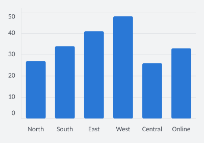
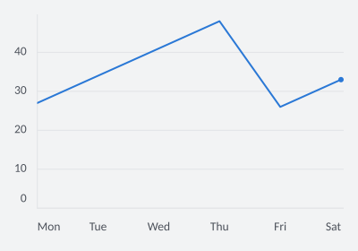
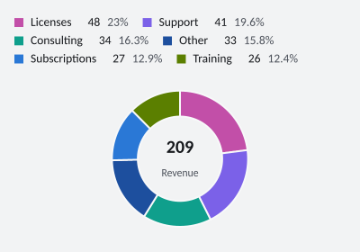
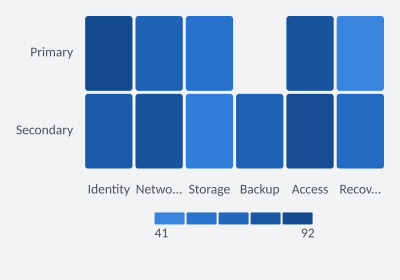
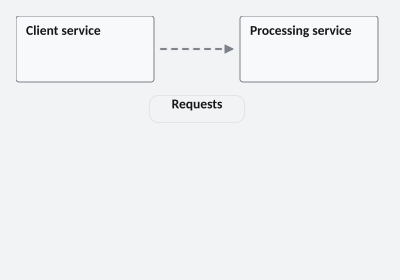
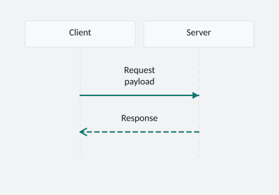

# ChartForgeX - Dependency-Free Chart Rendering for .NET

ChartForgeX renders polished charts, animated visual stories, visual blocks, topology diagrams, and static report visuals from .NET without adding runtime chart dependencies to generated output.

## NuGet Package

[](https://www.nuget.org/packages/ChartForgeX)
[](https://www.nuget.org/packages/ChartForgeX)

## Project Information

[](https://github.com/EvotecIT/ChartForgeX)
[](https://github.com/EvotecIT/ChartForgeX)
[](https://github.com/EvotecIT/ChartForgeX/actions/workflows/quality.yml)

## Author & Social

[](https://twitter.com/PrzemyslawKlys)
[](https://evotec.xyz/hub)
[](https://www.linkedin.com/in/pklys)
[](https://www.threads.net/@przemyslaw.klys)
[](https://evo.yt/discord)

## What It Does

Cartesian series are clipped to the plot rectangle in SVG and PNG. Markers whose centers are inside the plot retain their radius at its edge. Use `chart.WithPlotClipping(false)` when a report intentionally needs series overflow.

Automatic linear domains use evenly spaced round ticks; explicit axis bounds remain authoritative. Histogram counts use equal-width bins aligned to multiples of a nice decimal step (1, 2, 2.5, 5 or 10 times a power of ten). `ChartHistogramBinLayout.FromWidth` preserves the chosen width and extends both edges to its multiples. Use the overload with `roundBounds: false` for exact data-bounded intervals, including a shorter final remainder bin. A single requested bin spanning negative and positive values needs two aligned bins because zero is a boundary.

PNG chart grids and mixed visual grids render their children at the density of the destination panel. A 2x dashboard therefore retains the text and line detail of its charts and scorecards rendered alone at 2x, including panels enlarged by the grid layout.

SVG layout and PNG drawing resolve the same font-family stack and requested role weight, including map route and region labels. Register fonts with `FontRegistry` to use the same faces on different rendering hosts; the renderers use the existing dependency-free font reader and shaper.

Charts and topology share measured label placement across SVG and PNG. Labels try ordered positions, shorten plain text with an ellipsis, then drop when no collision-free position fits. Axis labels thin while retaining their tick positions. Hidden values remain in accessible names and `data-cfx-*` metadata. See [measured label placement](docs/label-placement.md) for priorities, deliberate labels inside their own marks, font fallback and the reusable `LabelPlacementService` API.

ChartForgeX turns .NET data into deterministic static visuals: charts, chart grids, visual blocks, visual canvases, topology diagrams, and map-backed report graphics. It is meant for generated reports, documentation, email, static websites, dashboards, wallpapers, social preview images, Office-style generators, and other hosts that need polished output without a JavaScript chart dependency.

The core package renders SVG, script-free static HTML, PNG, JPEG, BMP, PPM, and TIFF without runtime package dependencies. `ChartForgeX.Stories` adds GIF/APNG encoding. Optional browser behavior lives in adapter packages, so a static report can stay static while a dashboard can opt into tooltips, selection, zoom, pan, brush ranges, synchronized charts, and export controls.

## Shared prepared rendering

The prepared pipeline lays out a supported chart once, then exports SVG and native PNG from the same detached scene. The shared context controls its logical size, frame, canonical light/dark palette and typography. The initial route supports selected Cartesian and pie/donut options plus small topology/sequence diagrams; unsupported options fail explicitly while the existing exporters remain available.

```csharp
using ChartForgeX.Rendering;
using ChartForgeX.Themes;

var context = new VisualRenderContext(
    new VisualLayoutOptions(new VisualSize(800, 440)),
    themeMode: VisualThemeMode.Dark,
    frame: new VisualFrame("Checks over time", showLegend: true));
var prepared = chart.Prepare(context);
string svg = prepared.ToSvg("report-checks");
byte[] png = prepared.ToPng();
```

See the [architecture and phase boundaries](docs/v2/architecture.md), [API conventions](docs/v2/api-conventions.md), [consumer migration guide](docs/v2/migration.md) and [family capability roadmap](docs/v2/chart-capabilities.csv). Generate the isolated review catalog with `dotnet run --project ChartForgeX.Examples -c Release -- --v2-only --output <directory>`.

## Visual Tour

Charts and diagrams share the same theme, typography and chart area. These 400 × 280 previews are generated from the current examples. Open an example to switch between light and dark, compare SVG with native PNG, or copy its C# source.

<table>
  <tr>
    <td width="50%">
      <a href="https://preview.evotec.xyz/?url=https%3A%2F%2Fgithub.com%2FEvotecIT%2FChartForgeX%2Fblob%2Fmain%2FWebsite%2Fstatic%2Fexamples%2Fgenerated%2Ffamily-bar-wide-light.html"></a>
      <br />
      <strong>Completed orders by region</strong><br />Bar
      <br />
      <a href="https://preview.evotec.xyz/?url=https%3A%2F%2Fgithub.com%2FEvotecIT%2FChartForgeX%2Fblob%2Fmain%2FWebsite%2Fstatic%2Fexamples%2Fgenerated%2Ffamily-bar-wide-light.html">Light HTML</a> / <a href="https://preview.evotec.xyz/?url=https%3A%2F%2Fgithub.com%2FEvotecIT%2FChartForgeX%2Fblob%2Fmain%2FWebsite%2Fstatic%2Fexamples%2Fgenerated%2Ffamily-bar-wide-dark.html">Dark HTML</a> /
      <a href="Website/static/examples/generated/family-bar-wide-light.svg">SVG</a> / <a href="Website/static/examples/generated/family-bar-wide-light.png">PNG</a> / <a href="Website/static/examples/generated/family-bar-wide-light.csharp.txt">C#</a>
    </td>
    <td width="50%">
      <a href="https://preview.evotec.xyz/?url=https%3A%2F%2Fgithub.com%2FEvotecIT%2FChartForgeX%2Fblob%2Fmain%2FWebsite%2Fstatic%2Fexamples%2Fgenerated%2Ffamily-line-wide-light.html"></a>
      <br />
      <strong>Weekly request volume</strong><br />Line
      <br />
      <a href="https://preview.evotec.xyz/?url=https%3A%2F%2Fgithub.com%2FEvotecIT%2FChartForgeX%2Fblob%2Fmain%2FWebsite%2Fstatic%2Fexamples%2Fgenerated%2Ffamily-line-wide-light.html">Light HTML</a> / <a href="https://preview.evotec.xyz/?url=https%3A%2F%2Fgithub.com%2FEvotecIT%2FChartForgeX%2Fblob%2Fmain%2FWebsite%2Fstatic%2Fexamples%2Fgenerated%2Ffamily-line-wide-dark.html">Dark HTML</a> /
      <a href="Website/static/examples/generated/family-line-wide-light.svg">SVG</a> / <a href="Website/static/examples/generated/family-line-wide-light.png">PNG</a> / <a href="Website/static/examples/generated/family-line-wide-light.csharp.txt">C#</a>
    </td>
  </tr>
  <tr>
    <td width="50%">
      <a href="https://preview.evotec.xyz/?url=https%3A%2F%2Fgithub.com%2FEvotecIT%2FChartForgeX%2Fblob%2Fmain%2FWebsite%2Fstatic%2Fexamples%2Fgenerated%2Ffamily-donut-wide-light.html"></a>
      <br />
      <strong>Services contributing to revenue</strong><br />Donut
      <br />
      <a href="https://preview.evotec.xyz/?url=https%3A%2F%2Fgithub.com%2FEvotecIT%2FChartForgeX%2Fblob%2Fmain%2FWebsite%2Fstatic%2Fexamples%2Fgenerated%2Ffamily-donut-wide-light.html">Light HTML</a> / <a href="https://preview.evotec.xyz/?url=https%3A%2F%2Fgithub.com%2FEvotecIT%2FChartForgeX%2Fblob%2Fmain%2FWebsite%2Fstatic%2Fexamples%2Fgenerated%2Ffamily-donut-wide-dark.html">Dark HTML</a> /
      <a href="Website/static/examples/generated/family-donut-wide-light.svg">SVG</a> / <a href="Website/static/examples/generated/family-donut-wide-light.png">PNG</a> / <a href="Website/static/examples/generated/family-donut-wide-light.csharp.txt">C#</a>
    </td>
    <td width="50%">
      <a href="https://preview.evotec.xyz/?url=https%3A%2F%2Fgithub.com%2FEvotecIT%2FChartForgeX%2Fblob%2Fmain%2FWebsite%2Fstatic%2Fexamples%2Fgenerated%2Ffamily-heatmap-wide-light.html"></a>
      <br />
      <strong>Coverage across service areas</strong><br />Heatmap
      <br />
      <a href="https://preview.evotec.xyz/?url=https%3A%2F%2Fgithub.com%2FEvotecIT%2FChartForgeX%2Fblob%2Fmain%2FWebsite%2Fstatic%2Fexamples%2Fgenerated%2Ffamily-heatmap-wide-light.html">Light HTML</a> / <a href="https://preview.evotec.xyz/?url=https%3A%2F%2Fgithub.com%2FEvotecIT%2FChartForgeX%2Fblob%2Fmain%2FWebsite%2Fstatic%2Fexamples%2Fgenerated%2Ffamily-heatmap-wide-dark.html">Dark HTML</a> /
      <a href="Website/static/examples/generated/family-heatmap-wide-light.svg">SVG</a> / <a href="Website/static/examples/generated/family-heatmap-wide-light.png">PNG</a> / <a href="Website/static/examples/generated/family-heatmap-wide-light.csharp.txt">C#</a>
    </td>
  </tr>
  <tr>
    <td width="50%">
      <a href="https://preview.evotec.xyz/?url=https%3A%2F%2Fgithub.com%2FEvotecIT%2FChartForgeX%2Fblob%2Fmain%2FWebsite%2Fstatic%2Fexamples%2Fgenerated%2Ftopology-expanded-light.html"></a>
      <br />
      <strong>Service request topology</strong><br />Topology
      <br />
      <a href="https://preview.evotec.xyz/?url=https%3A%2F%2Fgithub.com%2FEvotecIT%2FChartForgeX%2Fblob%2Fmain%2FWebsite%2Fstatic%2Fexamples%2Fgenerated%2Ftopology-expanded-light.html">Light HTML</a> / <a href="https://preview.evotec.xyz/?url=https%3A%2F%2Fgithub.com%2FEvotecIT%2FChartForgeX%2Fblob%2Fmain%2FWebsite%2Fstatic%2Fexamples%2Fgenerated%2Ftopology-expanded-dark.html">Dark HTML</a> /
      <a href="Website/static/examples/generated/topology-expanded-light.svg">SVG</a> / <a href="Website/static/examples/generated/topology-expanded-light.png">PNG</a> / <a href="Website/static/examples/generated/topology-expanded-light.csharp.txt">C#</a>
    </td>
    <td width="50%">
      <a href="https://preview.evotec.xyz/?url=https%3A%2F%2Fgithub.com%2FEvotecIT%2FChartForgeX%2Fblob%2Fmain%2FWebsite%2Fstatic%2Fexamples%2Fgenerated%2Fsequence-expanded-light.html"></a>
      <br />
      <strong>Request processing sequence</strong><br />Sequence
      <br />
      <a href="https://preview.evotec.xyz/?url=https%3A%2F%2Fgithub.com%2FEvotecIT%2FChartForgeX%2Fblob%2Fmain%2FWebsite%2Fstatic%2Fexamples%2Fgenerated%2Fsequence-expanded-light.html">Light HTML</a> / <a href="https://preview.evotec.xyz/?url=https%3A%2F%2Fgithub.com%2FEvotecIT%2FChartForgeX%2Fblob%2Fmain%2FWebsite%2Fstatic%2Fexamples%2Fgenerated%2Fsequence-expanded-dark.html">Dark HTML</a> /
      <a href="Website/static/examples/generated/sequence-expanded-light.svg">SVG</a> / <a href="Website/static/examples/generated/sequence-expanded-light.png">PNG</a> / <a href="Website/static/examples/generated/sequence-expanded-light.csharp.txt">C#</a>
    </td>
  </tr>
</table>

Explore all chart families in the [gallery](https://preview.evotec.xyz/?url=https%3A%2F%2Fgithub.com%2FEvotecIT%2FChartForgeX%2Fblob%2Fmain%2FWebsite%2Fstatic%2Fexamples%2Fgenerated%2Fcatalog.html). Each example includes light and dark themes, SVG and PNG previews, and C# source.

## Examples

Run the example project when changing renderers, themes, chart APIs, or gallery metadata:

```powershell
dotnet run --project .\ChartForgeX.Examples\ChartForgeX.Examples.csproj -c Release
```

Generated output is written to `ChartForgeX.Examples/bin/Release/net8.0/output/`.

Useful review entry points:

- `index.html` - full generated gallery.
- `catalog.html` - examples grouped by chart family.
- `topology-demo.html` - focused topology demo hub with the scenario route explorer.
- `global-estate-premium-topology.html` - image-backed hierarchy with badges, secondary labels, status overlays, nested clusters, and drill navigation.
- `graph-2000-interactive.html` plus `graph-2000-stage-01-overview.*` through `graph-2000-stage-05-full.*` - one 2,001-object hierarchy as an interactive WebGL/Barnes-Hut explorer and deterministic static report stages.
- `enterprise-access-graph-benchmark.html` - accelerated graph explorer benchmark with 360 nodes, 720 directed edges, compact-document rendering, drag, pan, zoom, LOD, and telemetry.
- `svg-png-comparison.html` - side-by-side renderer parity review.
- `quality-dashboard.html` - visual health summary.
- `premium-surface-manifest.json` - exact wallpaper, social preview, compact email, report strip, and transparent overlay contracts used by the release build.

Example cards link HTML, SVG, PNG, and C# snippets when a checked source sample exists.

The release quality loop compares every generated SVG/PNG pair, including the full topology catalog, against the shared numeric visual baseline. It also renders real host-sized fixtures at high PNG density: a 1920x1080 desktop wallpaper, 1200x630 social preview, compact email grid, report strip, and transparent overlay. Dimension, readability, renderer-health, and alpha regressions fail the build.

Fixed canvases retain exact baseline dimensions on every platform. Reviewed content-sized gallery exports record their outer frame's resolved font bytes and face selection. Their natural height may differ when the same font request resolves to different fonts; widths, PNG scale and allocation, readability, clipping, visibility and edge-ink checks remain enforced. Missing font provenance keeps the height comparison strict.

For explicit 1k, 5k, and 10k browser scale fixtures, run:

```powershell
dotnet run --project .\ChartForgeX.Examples\ChartForgeX.Examples.csproj -c Release -- --graph-scale-only
```

## Install

```powershell
dotnet add package ChartForgeX
```

For canvas and factual-block examples, also install `ChartForgeX.Visuals`. For stories, terminal playback and GIF/APNG output, install `ChartForgeX.Stories`.

ChartForgeX targets `net472`, `netstandard2.0`, `net8.0`, and `net10.0`. The core package has no runtime package dependencies. The `net472` target uses `Microsoft.NETFramework.ReferenceAssemblies.net472` as a private build-time reference only.

Optional visual artifact, markup, Mermaid, and interaction support is split into separate packages:

| Package | Purpose |
| --- | --- |
| `ChartForgeX` | Charts, genuine diagrams, prepared scenes, semantic artifacts and still-image codecs. |
| `ChartForgeX.Visuals` | Static canvas, image composition, metric tiles, tables, lists and ordered watermark decoration. |
| `ChartForgeX.Stories` | Visual and terminal stories, transcripts, motion, animated topology and GIF/APNG output. |
| `ChartForgeX.Mermaid` | Source-preserving Mermaid parser with first-class flowchart, sequence, class, state, ER, requirement, architecture, C4, git graph, block, packet, Venn, Ishikawa, Wardley, mindmap, tree view, event modeling, kanban, pie, journey, timeline, quadrant, Gantt, XY chart, Sankey, radar, and treemap rendering. |
| `ChartForgeX.Markup` | Markdown-friendly v1 ChartForgeX visual fences for chart, timeline, topology, flow, sequence, and table artifacts. |
| `ChartForgeX.Markup.Mermaid` | Thin optional bridge that lets `ChartForgeX.Markup` parse Mermaid fences through `ChartForgeX.Mermaid`. |
| `ChartForgeX.Interactivity` | Host-neutral interaction contracts. |
| `ChartForgeX.Interactivity.Html` | Self-contained chart and topology interaction adapter, including interactive topology pages, the stencil browser, and the graph explorer with SVG, Canvas, WebGL, hierarchy navigation, compact large-scene documents, and atomic runtime updates. |

The core package also includes product-neutral visual artifact models for reusable visuals. `Chart` models can be wrapped as artifacts, `FlowArtifact` keeps authored process flows distinct from topology previews, and `SequenceArtifact` models interaction diagrams; their static previews render deterministically from core. The core `TableArtifact` model declares capabilities such as search, sort, filter, selection, copy, export, and virtualization. Its static table previews use `ChartForgeX.Visuals`. Rich interaction belongs in native hosts and adapter packages. See `docs/visual-artifacts.md`, `docs/markup.md`, `docs/markup-v1-reference.md`, and `docs/mermaid.md` for the current contracts.

## Native AOT and Trimming

ChartForgeX is designed to work in trimmed and Native AOT applications on modern .NET targets. The `net8.0` and `net10.0` package assets declare AOT compatibility, enable trim/single-file/AOT analyzers, and avoid reflection-driven serialization or dynamic code paths in the rendering surface.

The release quality loop publishes and runs `ChartForgeX.AotSmoke` as a Native AOT executable. That smoke app renders SVG, static HTML, PNG, chart grids, visual blocks, topology diagrams, and the self-contained HTML interaction adapter, so AOT regressions fail before a package is published.

## Output API

The output API follows one rule: `To*` returns content, `Save*` writes a file, and `Write*` streams bytes.

| Need | Use |
| --- | --- |
| SVG markup | `chart.ToSvg()` or `chart.SaveSvg("chart.svg")` |
| Static HTML | `chart.ToHtmlFragment()`, `chart.ToHtmlPage()`, or `chart.SaveHtml("chart.html")` |
| Interactive topology HTML | `topology.ToInteractiveHtmlFragment()`, `topology.ToInteractiveHtmlPage()`, or `topology.SaveInteractiveHtml("topology.html")` from `ChartForgeX.Interactivity.Html` |
| PNG bytes/file | `chart.ToPng()` or `chart.SavePng("chart.png")`; `RasterImageOptions.Dpi` writes physical PNG density metadata without changing pixel dimensions |
| Artifact watermark | Add `ChartForgeX.Visuals`, call `artifact.WithWatermarks(...)` with ordered text/image `VisualWatermark` values, then export SVG, HTML or PNG |
| Office and Visio handoff | `ToVisualArtifact()` on charts, chart grids, canvases, stories, topology, flow, sequence, tables, and visual blocks; use `ToInterchangeUtf8Json()` for an ALC-safe semantic payload, then consume it through the optional `OfficeIMO.ChartForgeX` adapter for document placement or native editable Visio projection |
| Direct RGBA pixels | `chart.ToRgbaImage()`, `topology.ToRgbaImage(options)`, or the equivalent grid, visual-block, and canvas helpers when a host will compose the result instead of saving it |
| Layered visual canvas | `VisualCanvas.CreateSocialPreview()`, `VisualCanvas.CreateDesktopWallpaper()`, `canvas.ToSvg()`, `canvas.SavePng("social-preview.png")`, or `canvas.Save("social-preview.jpg", rasterOptions)` for fixed-size wallpaper, social image, report cover, and hero compositions |
| Reusable image composition | Add `ChartForgeX.Visuals` for `ImageComposition.FromFile("wallpaper.jpg").DrawImage(...).DrawText(...).StrokeRectangle(...).Save("wallpaper-output.jpg")`, `composition.Write(stream, RasterImageFormat.Png)`, or `ImageComposition.TryFromBytes(...)` for dependency-free background plus overlay generation |
| RGBA frame animation | Add `ChartForgeX.Stories` for `RasterAnimationEncoder.Encode(frames, RasterAnimationFormat.Gif, options)` or `.WriteTo(stream, frames, RasterAnimationFormat.Apng, options)` with individual frame durations and finite or infinite playback; see [frame animation](docs/raster-animation.md) |
| Shapes on a composition | `composition.FillCircle(...)`, `StrokeCircle(...)`, `FillEllipse(...)`, `StrokeEllipse(...)`, `DrawArc(cx, cy, radius, startAngle, sweepAngle, color, thickness, ImageLineCap.Round)`, `DrawProgressRing(cx, cy, radius, thickness, fraction, trackColor, color)`, `FillRectangleLinearGradient(...)`, and `FillRectangleRadialGradient(...)`; all antialiased with the same coverage as SVG raster fills |
| SVG document to pixels | `SvgRasterizer.ToPng(svg)` for encoded bytes, `SvgRasterizer.ToImage(svg)` for direct RGBA composition, or `SvgRasterizer.Rasterize(svg, strict: true)` to reject reported rendering losses; [Visual Canvas](docs/visual-canvas.md) describes diagnostics and subset limits |
| Bounded raster input | `RasterImageDecoder.Read(stream, new RasterDecodeOptions { MaximumEncodedBytes = 8 * 1024 * 1024, MaximumPixels = 4_000_000 })` for a host-defined input budget across the six supported raster formats |
| Fonts for PNG output | `FontRegistry.Register("Inter", "fonts/Inter-Regular.ttf")`, `Register("Inter", "fonts/Inter-Bold.ttf", weight: 700)`, `FontRegistry.RegisterFile(path)`, or `FontRegistry.RegisterDirectory("fonts")` once at startup (`.ttf`, `.otf`, `.ttc`, and `.otc`, TrueType or CFF outlines), then name the family in chart, topology, and canvas themes, `FontSpec.FromFamily("Inter")`, or SVG `font-family`; registering `sans-serif` sets the fallback for hosts such as containers that have no fonts |
| Font shaping in PNG output | Missing characters use the font stack, registered fonts, then platform fallback faces. Shared GSUB/GPOS layout provides font ligatures, contextual forms, kerning and mark attachment; Hebrew and Arabic use Unicode bidi ordering. Indic syllables, Thai/Lao AM vowels, Khmer coeng and split vowels, Sinhala joiner forms and modern Myanmar kinzi use script-specific feature stages and reordering. See [docs/visual-canvas.md](docs/visual-canvas.md#characters-the-face-does-not-have-right-to-left-text-and-arabic) |
| Colour fonts and emoji | PNG and SVG rasterization paint COLR v0/v1 with the selected CPAL palette, including gradients, transforms, clipping and composites. CBDT/CBLC and sbix fonts use bitmap strikes at the output pixel size. Registered colour-only faces and font-provided ZWJ ligatures share text measurement, fitting and rotation; applications supply their font files |
| Small text in PNG output | Labels at 12 output pixels and below align vertical landmarks by default. Choose `TextHinting.Full` through `TextStyle.Hinting` or `ChartOptions.PngTextHinting` to use exact-size horizontal EBDT monochrome strikes or fit narrow straight outline stems while retaining measured layout. Choose `TextHinting.None` for exact outlines, such as animation frames |
| Topology animated raster | Add `ChartForgeX.Stories`, create `topology.WithMotion(motion, options)`, then call `ToGif()` or `ToApng()`; file helpers are `topology.SaveGif("route.gif", options, motion)` and `topology.SaveApng("route.apng", options, motion)` |
| Extension-inferred still output | `chart.Save("chart.svg")`, `chart.Save("chart.html")`, `chart.Save("chart.png")`, `chart.Save("chart.jpg")` or `chart.Save("chart.tiff")` |
| Advanced raster output | `ToRasterImage`, `WriteRasterImage` and `SaveRasterImage` for PNG, JPEG, BMP, PPM and TIFF; add Stories for `chart.ToRgbaImage().ToGif()` or `composition.ToImage().ToGif()` |

`Save(path)` infers `.svg`, `.html`, `.htm`, `.png`, `.jpg`, `.jpeg`, `.bmp`, `.ppm`, `.tiff` and `.tif`. Stories owns GIF/APNG output, including a one-frame GIF from resolved RGBA pixels. Animated GIF output uses an adaptive palette, error diffusion and cropped delta frames. APNG keeps full RGBA color and crops unchanged frame regions. Unsupported or empty extensions fail before a file is opened. `RasterImageOptions` controls JPEG quality, PNG compression level, physical DPI metadata and the background used when alpha must be flattened.

## Typed Data, Axes, and Facets

ChartForgeX has one chart construction surface. Hosts can keep their own records, transform them through immutable `ChartDataset<T>` values, and map them directly into native charts without maintaining a second set of chart DTOs.

```csharp
using ChartForgeX.Core;
using ChartForgeX.Data;

var samples = ChartDataset<CpuSample>.From(new[] {
    new CpuSample("Warsaw", 1, 35),
    new CpuSample("Warsaw", 2, 42),
    new CpuSample("London", 1, 48),
    new CpuSample("London", 2, 61)
});

var report = ChartGrid.FromFacets(
    samples,
    sample => sample.Site,
    (site, rows) => Chart.Create()
        .WithTitle(site)
        .WithYAxis("CPU (%)")
        .ConfigureYAxis(axis => axis.WithBounds(0, 100))
        .AddLine("CPU", rows, sample => sample.Minute, sample => sample.Cpu),
    columns: 2);

report.SavePng("cpu-by-site.png");
report.SaveSvg("cpu-by-site.svg");

record CpuSample(string Site, double Minute, double Cpu);
```

Legends with a single entry are hidden by default. Use `chart.WithLegend(true)` or assign `chart.Options.ShowLegend = true` to display one explicitly. Pie and donut names and percentages share one legend item, with the percentage directly after the name. Gauge swatches use the drawn value color.

Legends reserve at most 35% of the chart height by default. Additional entries are summarized as `+ N more entries`; all data remains plotted. If a custom height budget cannot fit one readable row, ChartForgeX omits the legend instead of overlapping the plot. This applies to series, point, pie, radial-bar, and state-timeline legends in SVG and PNG. Use `chart.WithLegendBudget(maximumHeightFraction: 0.3, maximumRows: 4)` to tune the budget. For many distinct signals, a faceted grid usually communicates more clearly than placing every series on one axis. SVG exposes visible summaries as `data-cfx-role="legend-overflow"` with `data-cfx-omitted` for hosts.

For larger reports, apply shared axes to the whole grid, then paginate before rendering:

```csharp
report.WithSharedAxes().WithPanelSize(440, 280);
foreach (var page in report.Paginate(maximumChartsPerPage: 6)) {
    page.Grid.WithSubtitle($"Page {page.Number} of {page.TotalPages}");
    page.Grid.SaveSvg($"cpu-by-site-{page.Number}.svg");
    page.Grid.SavePng($"cpu-by-site-{page.Number}.png");
}
```

Pages preserve chart order, panel spans, heading styles, and export settings. Their grids share the original chart and theme objects; changing a chart affects every grid containing it. Grid-level settings and styles are copied independently. Page metadata records the original partition. Empty columns remain in composed exports, keeping the last page aligned. Set `PanelSize` for consistent panel dimensions; automatic sizing uses each page's charts. The limit counts charts, not rows or pixels occupied by spanned panels. Empty grids return no pages.

`ChartAxis` owns bounds, tick count, label density, formatting, and `Linear`, `Logarithmic`, `SymmetricLogarithmic`, or `Time` scaling. Direct helpers such as `ChartPoints.FromValues(...)` and `ChartBubbles.FromXYSize(...)` remain available when a typed data pipeline is unnecessary.

`Time` axes treat values as UTC instants. Ticks snap to whole seconds, minutes, hours, days, Monday-aligned weeks, months, or years chosen from the visible range and `TickCount`; midnight ticks show `yyyy-MM-dd` and other ticks show `HH:mm`. `chart.WithXAxisTimeScale(timeZone, showTimeZone: true)` moves alignment and labels to a display zone (skipping missing daylight-saving hours) and appends the designator to the x-axis title, for example `Observed (UTC)`. Subsecond or unrepresentable ranges use distinct numeric OLE-date labels; explicit label mappings retain their exact values. Classic timeline and Gantt schedules retain wall-clock dates, omit an unapplied time-zone designator, and keep ticks inside the visible bounds. Points with `breakBefore` keep their gaps. Instant entry points (`ChartPoint`, `ChartAxisLabel`, and the range, interval, bubble, box-plot, and financial types) store UTC instants: `DateTimeKind.Local` values are converted to UTC and `Unspecified` values are treated as UTC, so series built from local and UTC timestamps line up. Date-based charts (calendar heatmaps, the classic timeline and Gantt, and `WithGanttToday`) keep wall-clock dates unchanged. `WithXDateLabels` follows the instant rule, so it lines up with date/time points; pair it with Unspecified dates on timeline or Gantt charts.

## Project Status

The ChartForgeX 1.0 surface uses one typed construction, typography, geometry, direction, and layout vocabulary. Pre-release duplicate APIs have been removed; see the [1.0 migration guide](docs/1.0-migration.md) for intentional breaking changes. Active follow-up work belongs in `TODO.md`; release notes belong in GitHub Releases and short NuGet package notes.

## Quick Start

```csharp
using ChartForgeX;
using ChartForgeX.Core;
using ChartForgeX.Primitives;
using ChartForgeX.Themes;

var chart = Chart.Create()
    .WithTitle("Domain Security Checks")
    .WithSubtitle("Dependency-free SVG, HTML, and PNG chart rendering")
    .WithXAxis("Run")
    .WithYAxis("Checks")
    .WithDesignTokens(VisualDesignTokens.GraphiteDark())
    .WithAccessibility(accessibility => accessibility.WithTextAlternative(
        "Domain security checks",
        "Passed checks rise during the week while warnings and failures decline.",
        "en"))
    .WithSize(1180, 640)
    .WithXLabels("Mon", "Tue", "Wed", "Thu", "Fri", "Sat", "Sun")
    .AddLine("Passed", Points(820, 940, 980, 1040, 1120, 1180, 1230))
    .AddLine("Warnings", Points(120, 138, 132, 110, 98, 86, 72))
    .AddLine("Failed", Points(22, 30, 28, 21, 18, 15, 13))
    .WithSeriesState("Passed", ChartSeriesState.Quiet)
    .WithSeriesState("Warnings", ChartSeriesState.Warning)
    .WithSeriesState("Failed", ChartSeriesState.Danger);

chart.SaveSvg("chart.svg");
chart.SaveHtml("chart.html");
chart.SavePng("chart.png");

static IEnumerable<ChartPoint> Points(params double[] y) {
    for (var i = 0; i < y.Length; i++) {
        yield return new ChartPoint(i + 1, y[i]);
    }
}
```

### Graphite themes and framing

Charts and visual blocks use Graphite light by default. Graphite dark uses the same layout with lifted colours:

```csharp
var tokens = VisualDesignTokens.GraphiteDark();
var chart = Chart.Create()
    .WithDesignTokens(tokens)
    .WithSvgColorVariables(tokens.ToSvgColorVariables())
    .WithTitle("Check results")
    .AddLine("Passed", Points(820, 940, 980))
    .AddLine("Warnings", Points(120, 138, 131))
    .AddLine("Failed", Points(22, 30, 27))
    .WithSeriesState("Passed", ChartSeriesState.Quiet)
    .WithSeriesState("Warnings", ChartSeriesState.Warning)
    .WithSeriesState("Failed", ChartSeriesState.Danger);
```

State roles are explicit; series names do not change colours. Healthy and quiet lines draw underneath the other series. Ordinary series use the categorical palette. SVG custom properties follow the token roles, including contrasting ink on filled marks, so a host can change the light/dark properties without regenerating the chart.

Graphite uses flat marks, straight 2 px lines, a marker on the last point, horizontal guides, and inline legends below the subtitle. Single-series legends are hidden. Donut and pie charts use a value-and-percentage list, with smaller slices combined into **Other** when more than six slices are present. Gauges, bullets, funnels and Sankey charts label their data directly.

Charts and diagrams share 24px default outer padding and a measured typography scale: 17px bold titles, 13.5px subtitles, 13px legends and 12px axes/data labels. Authored styles and sizes remain available. Pie and donut lists descend by value while retaining source point identities; raw values and muted percentages stay together. Compact exports recompute layout at their native size, and full labels remain available through semantic regions when a fixed canvas needs shortening or omission.

Use `.WithHostFrame()` when the embedding host provides the surface and padding. `ChartGrid` and `VisualGrid` use 16 px gaps and 15 px panel titles. Value labels use compact numbers; SVG accessible names and numeric `data-cfx-*` attributes retain the full values.

Arc gauges support targets and optional semantic bands through `.WithGauge(...)`; `ChartGaugeForm.Needle` selects a needle. `.AddLinearGauge("Readiness", 87)` uses neutral bullet bands, a thin measure and a value triangle. The named `ChartTheme.Light()`, `Dark()`, `ReportLight()`, `ReportDark()` and other presets remain available. `ChartBarStyle.Solid` and `SegmentedCapsule` opt into the earlier effect styles.

The [approved look specification](docs/design/chart-look-spec.html) shows both themes and the family geometry. See the [1.0 migration notes](docs/1.0-migration.md#graphite-default-look) for changed rendering defaults.

### Generated design tokens

Hosts that generate design tokens (the HtmlForgeX design tokens 1.x — 1.1.0 adds optional `ramps` — with `light` and `dark` objects holding `surface`, `text`, `chrome`, `accent`, `severity`, `outcome`, `state`, and `series`) can load them directly. Surfaces and text become the theme, `series` becomes the categorical palette in its fixed order, and severity, outcome, and state colours become `VisualDesignTokens.Status`. Status colours feed categorical families and explicitly declared series states; ordinary series keep the categorical palette:

```csharp
var tokens = VisualDesignTokens.FromJsonFile("tokens.json", VisualThemeMode.Dark);
var availability = Chart.Create()
    .WithDesignTokens(tokens)
    .WithStateCategories(tokens.Status.OperationalStateCategories());
```

`SeverityCategories()`, `OutcomeCategories()`, and `OperationalStateCategories()` return the keys `critical`…`info`, `pass`/`notEvaluated`/`couldNotEvaluate`, and `up`/`degraded`/`down`/`recovering`/`maintenance`/`notObservable`/`unknown`. Missing members fail with the JSON path, for example `light.severity.high.ink`. Optional `ramps` (a one-hue `sequential` array and a `diverging` object with `negative`/`positive` arms around a `neutral` colour, each weakest to strongest) become `SequentialRamp` and `DivergingRamp`. `WithDesignTokens` applies the sequential ramp to `ChartTheme.SequentialRamp`, which colours count heatmaps, hexbins, and calendars without an explicit colour; `DivergingRamp.ToColorScale(midpoint)` and `ToSequentialColorScale()` build map scales with every ramp step. The weakest ramp colour is used for the smallest value, since the tokens guarantee it stays visible on the card surface. Files without ramps still load. For pages that restyle charts from their own tokens, `chart.WithSvgColorVariables(tokens.ToSvgColorVariables())` (and `ChartGrid.WithSvgColorVariables` or `TopologyRenderOptions.SvgColorVariables`) writes every paint that uses a token colour as `var(--cfx-series-1, #2A78D6)`, with the literal colour as fallback, and translucent paints as `color-mix(in srgb, var(...) N%, transparent)`; pass a function to `ToSvgColorVariables` to use the host's property names (it receives token paths such as `surface.card`, `severity.high.fill`, `series.1`, or `ramps.sequential.3`). The renderers write colours by role: a colour they derive (the white sheen of a line, the highlight of a surface, a contrast stroke on a topology icon) stays literal even when it equals a token colour; a blend of colours (bar gradients, heatmap and calendar ramp steps, neutral zero and empty days, topology tints) is written as `color-mix(in srgb, …)` of the properties of its token operands; and a colour written for a role (series, status, ramp step, the surface behind marks) takes the variable of that role (`SvgColorRole`, assigned from the token path) when several tokens share it, so the property names the same token in every theme. Text matched by value never takes a surface token (so white labels on dark marks stay white), but text on filled marks (heatmap and hexbin values, categorical cell text, Gantt lane labels) is written by role: the surface behind the marks on strong marks (solid state marks, semantic cells, cells from 35 % of a sequential ramp, near-full series tints) and the text colour on weak ones (quiet and outlined marks, neutral zeros, the weakest ramp steps, light tints); when that colour reaches less than 3:1 on the mark and the other contrasts more, the other is used, which can differ between themes when a strong fill is close to the surface in one of them (draw the marks against the card, `WithMarkBackdrop(ChartMarkBackdrop.Card)`, as report hosts do). Line, bar, histogram, calendar, matrix and categorical heatmap (with or without cell text), hexbin, state timeline, Gantt lane, and donut charts drawn without card or plot surface, and layered topology diagrams with arrow and endpoint markers (whose ids name the edge status, `muted`, or the order of an explicit edge colour, never the colour itself), then paint the same in light and dark when the light drawing uses the dark values of its properties, so a host can ship one SVG for both themes. `SvgColorVariables.Apply(svg)` on finished markup only matches by value: when two variables share a colour the earlier one names it, and a derived colour that equals a token takes its variable. PNG output, and the CSS of HTML page and topology wrappers, keep literal colours.

## Composition

Use `ChartGrid` for chart-only small multiples, comparison grids, and mosaic reports. `Add(chart, columnSpan, rowSpan)` and `WithPanelSpan(index, columnSpan, rowSpan)` let a report mix hero panels with smaller supporting charts without creating a chart type just for layout.

```csharp
var report = ChartGrid.Create()
    .WithTitle("Control Scorecards")
    .WithTheme(ChartTheme.ReportLight())
    .WithColumns(2)
    .WithPanelSize(520, 320)
    .Add(gaugeChart, columnSpan: 2)
    .Add(trendChart)
    .Add(coverageChart)
    .WithPanelSpan(2, columnSpan: 2);

report.SaveHtml("scorecards.html");
report.SaveSvg("scorecards.svg");
report.SavePng("scorecards.png");
report.SaveBmp("scorecards.bmp");
report.SavePpm("scorecards.ppm");
report.SaveTiff("scorecards.tiff");
```

## Typography

Role styles use one shared contract in charts, chart grids, SVG, static HTML, and the dependency-free raster pipeline. That means the same color, family, size, weight, italic, decoration, baseline, casing, and font-language choices reach PNG, GIF, JPEG, BMP, PPM, and TIFF rather than being reinterpreted by each encoder.

Chart PNG text resolves numeric font weights for both measurement and painting. Titles, axis titles,
and legends use their SVG role weights when a style does not override them. Registered faces keep
font selection reproducible across hosts; simulated bold combines its coverage before painting,
so translucent text retains its opacity. A regular fallback face in a bold run receives synthetic
weight without changing its advance. Existing bold faces, explicit variable weight axes and colour
glyphs retain their authored ink.

Raster curves and rounded borders share the outline stroker, and thin contour details contribute
their area between sample rows. Image reduction filters premultiplied colors over the source
footprint. SVG raster strokes retain gradient or pattern paint, dash offsets, and affine outline
transforms instead of reducing those properties to a solid color or average stroke width.

```csharp
using ChartForgeX.Typography;

var chart = Chart.Create()
    .WithTitle("service health")
    .WithXAxis("Environment")
    .WithYAxis("Checks")
    .WithXLabels("production", "staging", "development")
    .WithTitleStyle(style => style
        .WithColor("#7C3AED")
        .WithFontFamily("Aptos, Segoe UI, sans-serif")
        .WithFontSize(28)
        .WithWeight("bold")
        .WithItalic()
        .WithUnderline(TextDecorationStyle.Wavy)
        .WithTextCase(TextCaseTransform.TitleCase))
    .WithTickLabelStyle(style => style
        .WithColor("#2563EB")
        .WithTextCase(TextCaseTransform.Uppercase))
    .WithDataLabelStyle(style => style
        .WithStrikethrough(TextDecorationStyle.Dotted)
        .WithSuperscript())
    .AddBar("Passing", Points(98, 94, 91));
```

`TextDecorationStyle` supports single, double, dotted, dashed, and wavy lines. `WithSubscript()` and `WithSuperscript()` select script placement. `TextCaseTransform` supports upper, lower, title, sentence, and toggle case; transforms are applied before measurement, fitting, wrapping, and rendering. SVG and HTML expose one native decoration-pattern value per text run, so when underline and strikethrough are combined with different patterns they use the underline pattern together; the raster owner can draw the two patterns independently.

Select a font's localized forms with `TextStyle.OpenTypeLanguageTag = "SRB"`, or a chart role override such as `.WithTickLabelStyle(style => style.WithOpenTypeLanguage("SRB"))`. The tag selects that font's GSUB/GPOS language system for measurement and drawing, including fallback faces. Tags such as `SRB` (Serbian) and `TRK` (Turkish) are case-sensitive OpenType tags, not culture names. A missing tag uses the font's default system. Null keeps the default on a complete style and inherits on an override; `WithOpenTypeLanguage("normal")` resets an override to the default. SVG carries this choice through CSS `font-language-override`, so native SVG display also depends on the browser's support and available fonts. The `language-forms-showcase` gallery example uses localized Serbian italic labels.

Select variable-font axes with `FontSpec.FromFile(path).WithVariation("wght", 650).WithVariation("opsz", 20)`, or a chart role such as `.WithTickLabelStyle(style => style.WithVariation("wdth", 85))`. Measurement, fitting and raster drawing use the selected TrueType or CFF2 instance, including its advances and positioning. Axis tags are case-sensitive four-character ASCII letters or digits; values are finite and clamped to the font's declared range. Unknown axes are ignored. An empty `FontVariationSettings.Default` resets an override; otherwise overrides inherit. Weight and size do not automatically choose axes. SVG and HTML carry explicit axes through `font-variation-settings` and depend on the browser's fonts. The `variable-font-showcase` gallery example uses weight and optical-size axes.

Font-authored GPOS device corrections adjust kerning and mark placement at the nearest whole logical font size. Measurement, fitting, and raster drawing share those positions; raising PNG export resolution preserves the layout. Native SVG text uses the browser's font engine. See [text rendering](docs/visual-canvas.md) for size, variation and hinting limits.

Use `ChartForgeX.VisualBlocks` when a report needs exact facts beside charts instead of pretending tables, lists, metric cards, status panels, or infographic snippets are chart series.

```csharp
using ChartForgeX.Core;
using ChartForgeX.Typography;
using ChartForgeX.VisualBlocks;

var drives = ChartTable.Create()
    .WithTitle("Drive Summary")
    .AddColumn("Drive")
    .AddColumn("Used", TextAlignment.Right, format: "0%")
    .AddColumn("Free", TextAlignment.Right)
    .AddColumn("Status")
    .AddRow("C:", 0.72, "128 GB", "OK")
    .AddRow("D:", 0.91, "34 GB", "Warning")
    .WithStatusColumn("Status")
    .WithDenseMode();

var snapshot = VisualGrid.CreateMetricStrip("Endpoint Snapshot", new[] {
    MetricCard.Create().WithMetric("CPU Load", "38%").WithMiniSparkline(new[] { 52d, 48d, 44d, 41d, 38d }),
    MetricCard.Create().WithMetric("Memory Used", "71%").WithMiniBars(new[] { 55d, 59d, 63d, 68d, 71d }, maximum: 100)
});
```

Build an authentic console presentation from structured commands, output, tables, and pauses:

```csharp
using ChartForgeX.Terminal;

var portfolio = TerminalTable.Create()
    .WithColumns("PROJECT", "STACK", "STATUS")
    .AddRow("ChartForgeX", ".NET", "ready")
    .AddRow("ImagePlayground", "PowerShell", "ready");

var console = TerminalStory.Create()
    .WithTitle(@"pwsh - C:\OpenSource")
    .WithDialect(TerminalDialect.PowerShell)
    .WithTheme(TerminalTheme.PowerShell())
    .WithWindowStyle(TerminalWindowStyle.WindowsTerminal)
    .WithWorkingDirectory(@"C:\OpenSource")
    .Command("Get-ActivePortfolio | Format-Table")
    .Table(portfolio)
    .Blank()
    .Command(@".\Invoke-ReleaseValidation.ps1")
    .Output("PASS  755 tests", TerminalTextTone.Success);

console.SaveSvg("console-demo.svg");
console.SaveHtml("console-demo.html");
console.SavePng("console-demo.png");
console.SaveGif("console-demo.gif");
console.SaveApng("console-demo.apng");
```

Tabs are persistent terminal sessions with independent buffers, prompts, working directories, icons, and palettes:

```csharp
var multiShell = TerminalStory.Create()
    .WithInitialTab("PowerShell", "PowerShell", TerminalDialect.PowerShell, @"C:\", TerminalTheme.Campbell(), TerminalTabIcon.PowerShell)
    .WithWindowStyle(TerminalWindowStyle.WindowsTerminal)
    .WithPlaybackSpeed(TerminalStoryPlaybackSpeed.Slow)
    .Command("Get-Module ImagePlayground")
    .DeclareTab("legacy", "Windows PowerShell", TerminalDialect.PowerShell, @"C:\Legacy", TerminalTheme.WindowsPowerShell(), TerminalTabIcon.WindowsPowerShell)
    .SelectTab("legacy")
    .Command("$PSVersionTable.PSVersion")
    .DeclareTab("ubuntu", "Ubuntu", TerminalDialect.Bash, "~/src", TerminalTheme.Ubuntu(), TerminalTabIcon.Ubuntu)
    .SelectTab("ubuntu")
    .Command("dotnet test")
    .SelectTab("PowerShell")
    .Output("All environments are ready.", TerminalTextTone.Success);
```

The renderer models a presentation, not a shell. Dialects control prompt behavior, themes control palettes, and `TerminalWindowStyle` independently selects macOS, Windows Terminal, minimal, or chrome-free presentation. The caller still owns any real process execution. `WithPlaybackSpeed(Slow|Normal|Fast)` coordinates typing, output cadence, and tab reading time; `WithTiming` and `WithTabHold` provide exact independent overrides. `DeclareTab` adds a persistent session and `SelectTab` performs the visible switch, while `OpenTab` remains the compact declare-and-switch operation. SVG and HTML use script-free command typing, output reveals, tab transitions, and a cursor; GIF and APNG sample that same timeline into portable animated frames; PNG, print, and reduced-motion rendering show the completed active tab while accessibility text retains every tab transcript. Animated raster export defaults to a one-times-density, 10 FPS, looping presentation with a bounded 240-frame budget; `TerminalStoryAnimationOptions` controls frame rate, looping, end hold, density, and the explicit frame budget.

### Generic visual stories

`VisualStory` presents resolved source, terminal, text, image, or SVG surfaces as a sequence of scenes. It is deliberately not tied to charts: API request/response demos, image before/after walkthroughs, deployment evidence, tutorials, and product tours use the same contract. Every story declares one or more outcomes, and rendering fails unless the completed scene still contains each outcome panel. A demo that promises a chart therefore has to show the chart, not merely print a filename.

```csharp
var story = VisualStory.Create("A chart in five lines")
    .WithDescription("Source and the real rendered result.")
    .WithSize(1100, 620);

story.Scene("write", "Write the code")
    .Panel("source", new VisualStorySourceSurface(source));
story.Scene("result", "See the chart", 1.5, VisualStorySceneLayout.Split)
    .Panel("source", new VisualStorySourceSurface(source))
    .Panel("chart", new VisualStoryMediaSurface(chartPng, "Weekly builds chart"));
story.Outcome("chart-visible", "The weekly builds chart is visible.", "chart");

story.SaveSvg("chart-story.svg");
story.SavePng("chart-story.png");
story.SaveGif("chart-story.gif");
```

ChartForgeX never executes the displayed source and has no parser dependencies. Optional hosts tokenize source through `IStorySourceTokenizer` and map parser-specific tokens to exact renderer-neutral `StorySourceSpan` ranges. Plain source remains valid when no adapter is supplied. This keeps the core dependency-free and lets PowerShell, Tree-sitter, Roslyn, or another host own the dependency appropriate to its environment.

Use `ChartForgeX.Stories` to add a script-free presentation to a static grid with stable target IDs and a reusable motion timeline:

```csharp
using ChartForgeX.Motion;
using System.IO;

var motion = VisualMotionTimeline.Create()
    .Reveal("title", durationSeconds: 0.65)
    .Cascade(new[] { "projects", "users", "releases" }, initialDelaySeconds: 0.25)
    .Rise("portfolio", delaySeconds: 0.7);

var grid = VisualGrid.Create()
    .WithTitle("Engineering Portfolio")
    .WithColumns(3)
    .Add("projects", projectsCard)
    .Add("users", usersCard)
    .Add("releases", releasesCard)
    .Add("portfolio", portfolioTable, columnSpan: 3);
var story = VisualMotionPresentation.Create(grid, motion);

File.WriteAllText("portfolio.svg", story.ToSvg());
File.WriteAllText("portfolio.html", story.ToHtmlPage());
File.WriteAllBytes("portfolio.png", story.ToPng());
```

SVG and complete HTML pages animate without JavaScript. PNG, print, and reduced-motion rendering use the same completed state, so every fact remains available without motion.

Segmented dashboard visuals use one generic block instead of domain-specific card classes. The same `SegmentedMetricBlock` can render progress rows, performance rows with exact values, balanced capsule loops, funnel columns, composition strips, or distribution rows; item colors fall back to the active theme palette unless a color or semantic status is supplied.

```csharp
var performance = SegmentedMetricBlock.Create(SegmentedMetricStyle.ProgressRows)
    .WithTitle("Content Performance")
    .AddItem(new SegmentedMetricItem("Posts", 86)
        .WithProgress(100, 44)
        .WithDisplayValue(132034, "N0")
        .WithDelta("+4.3%"));

var channels = SegmentedMetricBlock.Create(SegmentedMetricStyle.CapsuleLoop)
    .WithTitle("Channel Share")
    .AddItem("Direct", 40, displayValue: "24,000")
    .AddItem("Partner", 35, displayValue: "21,000")
    .AddItem("Referral", 15, displayValue: "9,000")
    .AddItem("Other", 10, displayValue: "6,000");

var certificates = SegmentedMetricBlock.Create(SegmentedMetricStyle.CompositionStrip)
    .WithTitle("Certificate Count")
    .WithMetric("Certificates", 277)
    .AddItem("Valid", 164, displayValue: "164")
    .AddItem("Expiring", 48, displayValue: "48")
    .AddItem("Revoked", 24, displayValue: "24")
    .AddItem("Unknown", 41, displayValue: "41");

var tasks = SegmentedMetricBlock.Create(SegmentedMetricStyle.CompositionStrip)
    .WithTitle("Overall Tasks")
    .WithMetric("Tasks", 23, "Task")
    .AddItem("On Going", 12, pattern: ChartFillPattern.DiagonalForward)
    .AddItem("Under Review", 6)
    .AddItem("Finish", 4);

var funnel = SegmentedMetricBlock.Create(SegmentedMetricStyle.FunnelColumns)
    .WithTitle("Conversion Funnel")
    .AddItem("Clicks", 82000, segments: 24, displayValue: "82,000")
    .AddItem("Added to Cart", 7200, segments: 16, displayValue: "7,200")
    .AddItem("Payment", 1230, segments: 12, displayValue: "1,230");
```

## Topology Diagrams

`ChartForgeX.Topology` is for reusable deterministic diagrams. It owns the product-neutral model, validation, layout helpers, SVG rendering, PNG rendering, and static HTML wrapper. Host projects own dashboard shells, data collection, filters, inspectors, and product-specific calculations.

```csharp
using ChartForgeX.Primitives;
using ChartForgeX.Topology;

var topology = TopologyChart.Create()
    .WithId("service-map")
    .WithTitle("Service Dependency Map")
    .WithLayout(TopologyLayoutMode.Layered, TopologyLayoutDirection.LeftToRight)
    .WithLegend(TopologyLegend.Default()
        .AddNodeKind("Service", TopologyNodeKind.Service, symbol: "API")
        .AddNodeKind("Database", TopologyNodeKind.Database, symbol: "SQL")
        .AddEdgeKind("Dependency", TopologyEdgeKind.Dependency))
    .AddNode("api", "API", 0, 0, TopologyNodeKind.Service, TopologyHealthStatus.Healthy, symbol: "API")
    .AddNode("database", "Database", 0, 0, TopologyNodeKind.Database, TopologyHealthStatus.Warning, symbol: "SQL")
    .AddEdge("api-database", "api", "database", "32 ms", TopologyEdgeKind.Dependency, TopologyHealthStatus.Warning, VisualLinkDirection.Forward);

topology.SaveSvg("service-map.svg");
topology.SaveHtml("service-map.html");
topology.SavePng("service-map.png");
topology.SaveBmp("service-map.bmp");
topology.SavePpm("service-map.ppm");
topology.SaveTiff("service-map.tiff");
```

Advanced edges may use named node ports, independent source/target markers, endpoint labels, custom width/opacity/dash patterns, and layout hints. Typed node detail rows keep operational facts inside a card without forcing callers to pre-render text. `TopologyLayoutPreset` provides dense, compact, balanced, and presentation spacing profiles, while `TopologyLayoutDiagnostics.Analyze(...)` exposes prepared node, port, route, obstacle, and collision geometry. Set `IncludeLayoutDiagnosticOverlay` only for authoring/debug output; it is off by default.

Supported topology layout modes are `Manual`, `GroupGrid`, `HubAndSpoke`, `Layered`, `Matrix`, `DenseGrouped`, and `Geographic`. Geographic topology uses `ChartMapViewport` with typed coordinates, route arcs, region hulls, and optional callouts while keeping the model reusable across infrastructure, cloud, tenant, inventory, and domain-specific hosts.

`ReadableDenseLayout` routes relationships together, accounts for fixed and waypoint corridors, and reconsiders crowded routes to reduce crossings. `ShareIncomingTrunks` lets matching solid relationships into one target share a painted tail while retaining each relationship's identity. See the [topology guide](docs/topology.md) for limits and generated examples.

When the host already owns node and edge records, use `TopologyChart.FromData<TNode, TEdge>(...)` to map stable ids, labels, endpoints, and product-neutral visual properties. The mapper preserves input order and rejects duplicates or dangling endpoints before rendering.

Dotted maps can render both point-to-point route arcs and ordered waypoint routes. Use `AddMapRoute("label", new[] { new ChartMapPoint("Origin", lon, lat), ... })` for paths such as shipping alternatives through the Suez Canal or around the Cape of Good Hope without adding shipping-specific concepts to the renderer. Light report themes render map geography as filled outlines instead of land-dot texture so routes stay readable on white backgrounds.

## Interactive Graph Explorer

`GraphScene` is the product-neutral relationship and large-topology document. It supports image and icon nodes, badges, secondary labels, rich edges, explicit or adaptive clusters, validated parent-child hierarchy, deterministic layouts, runtime physics, level of detail, performance budgets, atomic `GraphScenePatch` updates, and reusable `GraphSceneStage` planning. `ChartForgeX.Interactivity.Html` renders the same scene through SVG, Canvas, or WebGL and can save script-free stage SVG/PNG files without opening a browser.

The WebGL explorer renders rich node shapes, images, labels, badges and status details alongside styled routes with individual widths, curves, dashes and arrows. It retains geometry during viewport movement and falls back to Canvas after context loss while preserving the current graph and selection. The generated `graph-rich-rendering-*` examples exercise all three backends.

Small scenes keep complete SVG artwork. Large scenes switch to a compact graph document and batched rendering so they do not carry thousands of hidden SVG marks; SVG export reconstructs the vector scene on demand. The generated 1k/5k/10k fixtures are intended for real-browser release review rather than synthetic model-only claims.

```csharp
using ChartForgeX.Interactivity;
using ChartForgeX.Interactivity.Html;

var graph = GraphScene.Create("estate", "Global estate")
    .AddNode("global", "Global", node => node.BadgeText = "42")
    .AddNode("europe", "Europe", node => {
        node.ParentId = "global";
        node.SecondaryLabel = "4 sites · 18 workloads";
        node.Status = "warning";
    })
    .AddEdge("global-europe", "global", "europe", configure: edge => edge.Directed = true);

graph.Options.UseSuperTopologyDefaults();
graph.Options.Hierarchy.InitialRootNodeId = "global";
graph.Options.Hierarchy.InitialDepth = 1;
graph.Options.Physics.Solver = GraphPhysicsSolver.BarnesHut;
graph.Options.Physics.Stabilization.Iterations = 500;
graph.Options.Physics.BarnesHut.SpringLength = 82;
graph.Options.Physics.BarnesHut.AvoidOverlap = 0.7;
graph.Options.Interaction.NodeDragBehavior = GraphNodeDragBehavior.ReleaseAndReheat;

var html = graph.ToGraphExplorerHtmlPage(options => {
    options.RenderBackend = HtmlGraphRenderBackend.Svg;
    options.Theme = HtmlGraphExplorerTheme.System; // Follows the OS until the reader chooses Light or Dark.
    options.IncludeThemeToggle = true;
    options.PersistThemePreference = true;
    options.IncludePhysicsConfigurator = true; // Optional development-time tuning surface.
    options.PersistInteractionState = true; // Opt in; uses a scene-scoped localStorage key by default.
});

var stages = graph.SaveGraphStageImages("report-assets", "estate", options => {
    options.Stages.Depths.AddRange(new[] { 0, 1, 2, 5 });
    options.Formats = GraphSceneStaticImageFormat.Both;
    options.Render.MaximumNodeLabels = 160;
});
```

The generated explorer uses one responsive control system across SVG, Canvas, and WebGL. Search, filters, and appearance stay in a quiet discovery header; hierarchy and graph actions sit in floating stage controls, with consistent icon geometry, accessible tooltips, and a labeled export-format popover. System, light, and dark themes recolor the complete surface—including labels, edges, minimap, Canvas, and WebGL—not just the page chrome. Model label colors are retained when they remain readable and adapt to the active theme when they do not.

Nodes with children drill directly from the graph. Empty-space double-click, `Escape`, `Backspace`, Left Arrow, or a clickable breadcrumb move back up. Arrow keys move through a single roving graph-item tab stop, so a 2,000-node graph does not add 2,000 stops to the page. Box selection works across SVG, Canvas, and WebGL. Editing stays opt in through `GraphManipulationOptions`; enabled explorers use validated patches, cancelable host callbacks, bounded undo/redo, group dragging, and explicit position export. Reduced-motion mode removes drag momentum and visible intermediate physics frames; forced colors, increased contrast, live announcements, explicit control names, and strong focus indicators are built in. `PinOnDrop` remains available when manual placement should persist. See [Graph explorer](docs/graph-explorer.md) for themes and accessibility, solver profiles, static stage exports, clustering, hierarchy navigation, editing and state persistence, the browser API, host events, export behavior, and measured scale fixtures.

Dense ordered line, area, and scatter data can use either an explicit point count or a reusable display-resolution policy. `AddDecimatedLine`, `AddDecimatedArea`, and `AddDecimatedScatter` accept a maximum point budget. `AddAdaptiveLine`, `AddAdaptiveArea`, and `AddAdaptiveScatter` combine an intended render width with `ChartResolutionPolicy`; the report-friendly `ChartResolutionPolicy.Trend()` preset allows two points per horizontal pixel with a 64-point floor and applies deterministic LTTB only when needed. It also suppresses optional line and area markers above `MaximumMarkerCount`, avoiding marker clutter and redundant render nodes while leaving short series unchanged. Override a single series through `ChartSeries.WithMarkerRadius(...)` when a different visual treatment is intentional. `ChartSeries.SourcePointCount`, `SourcePointIndices`, and `DecimationMode` keep every reduction honest. SVG roots publish the same provenance, and interactive point identities resolve back to source indices.

Use `new ChartPoint(x, y, breakBefore: true)` for the first observed point after a gap. Line, step-line, area, and step-area output starts a separate segment there; SVG, HTML, and PNG leave the missing interval empty, including smoothed paths. Coordinates remain finite. Scatter accepts the flag without joining points; other series kinds reject it.

Decimation retains each segment's endpoints and original source indices. `MinMax` retains local extrema within each disconnected segment; these segments receive at least four points (or their full size when smaller). LTTB receives at least three. If a reduction budget cannot accommodate those minima, the API throws with the required total instead of joining or dropping segments. Increase the budget or split the display into smaller panels. See the [gapped signal example](ChartForgeX.Examples/DenseSignalExamples.cs).


Scenario timelines are also typed and opt in. Chart and topology scenarios support default and per-step timing, direct scrubber navigation, finite or looping playback, reduced-motion-safe autoplay, deep links, and a context-preserving highlight mode. Strong dimming is available through an explicit `Spotlight` focus mode rather than being imposed on every route. `ChartForgeX.Interactivity.Html` protects label readability on narrow screens with a contained readable viewport by default; hosts can choose whole-chart fitting when that tradeoff is preferable. See [Interactivity](docs/interactivity.md) for the model, browser events, and host commands.

## Stable hierarchy and flow IDs

Sankey, Tree, and Sunburst use immutable nodes with IDs separate from display labels. Links reference IDs, so two departments can each have a node named “Support”:

```csharp
var nodes = new[] {
    new ChartNode("teams", "Teams"),
    new ChartNode("north", "North"), new ChartNode("south", "South"),
    new ChartNode("north-support", "Support"), new ChartNode("south-support", "Support")
};
var links = new[] {
    new ChartTreeLink("teams", "north", 5), new ChartTreeLink("teams", "south", 8),
    new ChartTreeLink("north", "north-support", 5), new ChartTreeLink("south", "south-support", 8)
};
var chart = Chart.Create().AddSunburst("Teams", nodes, links);
```

Tree and Sunburst require one connected root and one incoming link per child. Tree placement is unweighted; Sunburst sectors use leaf weights, and internal values sum their leaves. Authored incoming weights remain available separately, including positive fractions below one millionth.

Sankey accepts directed `ChartFlowLink(id, sourceId, targetId, value)` records. Parallel flows use different IDs, and Sankey rejects cycles and self-links. `chart.Series[0].WithNodeState(id, state)` follows the node ID through input reordering or label changes. Semantic node states are scoped to their series, and `NodeStates` is a read-only view. Series expose immutable `Nodes`, `FlowLinks`, and `TreeLinks`; these families have no numeric `Points`. See the [migration guide](docs/v2/migration.md#hierarchy-and-flow-identities) for replaced signatures and metadata, and the [configured examples](ChartForgeX.Examples/V2GalleryModels.Relationships.cs) for repeated labels and parallel flows.

## Hierarchical Treemap

Treemap item IDs identify nodes independently of repeated display labels. A group contains its descendants and aggregates their leaf sizes; a nullable color value controls a separate numeric color scale:

```csharp
var chart = Chart.Create().WithDataLabels().AddTreemap("Allocation", new[] {
    new ChartTreemapItem("north", "North"),
    new ChartTreemapItem("north-team", "Team", parentId: "north"),
    new ChartTreemapItem("north-support", "Support", parentId: "north-team", value: 5, colorValue: -2),
    new ChartTreemapItem("south", "South"),
    new ChartTreemapItem("south-support", "Support", parentId: "south", value: 8, colorValue: 3),
    new ChartTreemapItem("research", "Research", value: 3)
}).ConfigureTreemap(options => {
    options.GroupPadding = 6;
    options.Gap = 3;
    options.ColorLegendTitle = "Change (%)";
    options.ColorScale = ChartColorScale.Diverging(
        ChartColor.FromRgb(94, 76, 160), ChartColor.FromRgb(229, 229, 233), ChartColor.FromRgb(204, 104, 52), 0);
});
chart.Series[0].WithNodeState("north-support", ChartSeriesState.Warning);
```

Leaves require finite non-negative `Value`; groups require null `Value`, and their rendered value is the sum of their leaves. Forests, standalone leaves, and zero sizes are supported. Zero sizes retain their source facts without a minimum-area rectangle. `ColorValue` is optional and may be negative. Its observed domain is independent of size, and an explicit scale range remains authoritative. Missing color values use the scale's `NoDataColor` or the theme's neutral paint. Named discrete bands use the same `ChartColorScale.Discrete` API as maps.

`ChartOptions.Treemap` controls group padding, sibling gaps, group labels, and the color legend. `ChartSeries.TreemapItems` is an immutable snapshot; `Points` remains empty. Point styling overrides use item input ordinals, while SVG and HTML targets retain item IDs through input reordering or label renaming. See the [migration guide](docs/v2/migration.md#hierarchical-treemap) and [configured examples](ChartForgeX.Examples/V2GalleryModels.Treemap.cs).

Interactive tooltips show area and color as separate values, including missing color data. `ColorLegendTitle` names the color tooltip row; otherwise it uses `ChartLabels.Color`. `WithLabels` localizes that name, `NoData`, and the discrete legend's `AllValues` and `Value` words.

`WithNodeState(id, state)` applies semantic styling by item ID. With a numeric color scale, the state appears as an outline and preserves the quantitative fill. Without a scale, shared state colors supply the fill unless an explicit color overrides them.

`WithPointLegend()` shows leaf keys when no numeric color legend is active. In interactive HTML, a leaf key reads its own value and toggles or isolates that node. Linked charts resolve leaf keys by ID even when their labels or input order differ.

## Chart catalog

The catalog is broad enough for generated reports, dashboards, operational summaries, and static documentation:

| Family | APIs |
| --- | --- |
| Cartesian lines and areas | `AddLine`, `AddSmoothLine`, `AddStepLine`, `AddArea`, `AddStepArea`, `AddSmoothArea`, `AddStackedArea`, `AddSmoothStackedArea`, `AddScatter`, `AddDecimatedLine`, `AddDecimatedArea`, `AddDecimatedScatter`, `ChartDecimator.Decimate`, `AddTrendLine`, `AddPointCallout`, `WithPointLabel`, `WithLegendEntry`, `WithSemanticRole`, `AddMeanLine`, `AddMedianLine`, `AddStandardDeviationBand`, `AddSlope` |
| Combo charts | `AddBarLineCombo`, `AddColumnLineCombo`, `AddBarAreaCombo`, `AddColumnAreaCombo`, `AddScatterLineCombo` |
| Bars and distributions | `AddBar`, `AddHistogram`, `AddLollipop`, `AddBubble`, `AddErrorBar`, `AddCandlestick`, `AddOhlc`, `AddRangeBand`, `AddRangeArea`, `AddDumbbell`, `AddPareto`, `AddRangeBar`, `AddBoxPlot`, `AddHorizontalBar`, `WithStackedHorizontalBars`, `WithBarStyle` (`Solid`, `Flat`, `SegmentedCapsule`) |
| Heatmaps and calendars | `AddHeatmapRow`, `AddHeatmapRows`, `ChartHeatmapRow`, `AddHexbinHeatmapRow`, `AddHexbinHeatmapRows`, `AddCalendarHeatmap`, `ChartCalendarHeatmapItem`, `AddHeatmapCategoryRow`, `ChartHeatmapCell`, `AddHourWeekdayHeatmap`, `ChartTimedValue`, `ChartTimeAggregation`, `HeatmapRelativeScale` |
| Maps | `AddDottedMap`, `ChartMapPoint`, `ChartMapViewport`, `WithMapViewport`, `AddMapConnector`, `AddMapRoute`, `AddMapConnectorBetweenPoints`, `AddMapRouteBetweenPoints`, `AddRegionMap`, `AddTileMap`, `ChartMapCatalog`, `ChartMapCatalogEntry`, `ChartMapCatalogEntryKind`, `EmbeddedEntries`, `ExternalEntries`, `Load`, `FromAssetDirectory`, `ChartMapDefinition`, `ChartMapRegion`, `ChartTileMapCatalog`, `ChartTileMapDefinition`, `ChartTileMapRegion`, `ChartRegionMapItem`, `WithMapLabels`, `WithMapScaleLegend`, `WithMapScaleLegendPosition`, `WithMapSurface`, `WithMapRegionStroke`, `WithRegionMapBounds`, `WithRegionMapCoordinateBounds`, `AddMapBaseLayer`, `AddMapBoundaryLayer` |
| KPI and radial visuals | `AddGauge`, `AddCircle`, `AddRadialBar`, `AddLayeredRadial`, `ChartRadialLayer`, `ChartRadialLayerCap`, `AddBullet`, `AddWaterfall`, `AddRadar`, `AddPolar`, `AddPolarArea` |
| Hierarchy and flow | `AddFunnel`, `AddTreemap`, `AddSankey`, `ChartNode`, `ChartFlowLink`, `AddTree`, `ChartTreeLink`, `AddSunburst`, `AddPie`, `AddDonut` |
| Pictorial and progress | `AddPictorial`, `ChartPictorialItem`, `ChartPictorialShape`, `ChartPictorialShape.Person`, `WithPictorialShape`, `WithPictorialColumns`, `WithPictorialMaximum`, `WithPictorialValuePerSymbol`, `WithPictorialValues`, `WithPictorialSymbolScale`, `WithPictorialEmptyOpacity`, `WithPictorialSvgPath`, `AddProgressBars`, `ChartProgressItem`, `WithProgressMaximum`, `WithProgressValues`, `WithProgressHandles`, `WithProgressBarThickness`, `WithProgressTrackOpacity` |
| Text, labels, and legends | `FontSpec`, `TextStyle`, `TextStyleOverride`, `LabelPlacementService`, `LabelPlacementRequest`, `LabelCandidate`, `LabelObstacle`, `PlacedLabel`, `TextAlignment`, `TextDecorationStyle`, `TextBaseline`, `TextCaseTransform`, `WithLegendPosition`, `WithPointLegend`, `ChartTextRole`, `WithTextStyle`, `WithTitleStyle`, `WithSubtitleStyle`, `WithAxisTitleStyle`, `WithTickLabelStyle`, `WithLegendStyle`, `WithDataLabelStyle`, `WithDonutCenterLabel`, `WithDonutCenterText`, `WithDonutInnerRadiusRatio`, `WithRadialBarCenterLabel`, `WithCircleStatusLabel`, `WithCircleRadiusScale`, `WithCircleStrokeScale`, `WithRadialBarRadiusScale`, `WithRadialBarStrokeScale` |
| Branding and themes | `ChartBrandKit`, `WithBrandKit`, `ChartBrandKit.Executive()`, `PeopleInfographic()`, `Accessible()`, `ChartTheme.Aurora()`, `ChartTheme.Colorblind()`, `ChartTheme.DashboardLight()`, `ChartTheme.SaasDashboardLight()`, `ChartFontStacks`, `ChartPalettes.Vivid` |
| Text-heavy and schedule visuals | `AddWordCloud`, `ChartWordCloudItem`, `WithWordCloudFontRange`, `WithWordCloudAngles`, `WithWordCloudMaximumTerms`, `WithWordCloudDensity`, `AddTimelineItem`, `AddTimelineRange`, `AddGanttTask`, `AddGanttMilestone`, `WithGanttToday` |
| Status over time | `AddStateTimelineLane`, `ChartStateTimelineSegment`, `AddGanttLane`, `ChartGanttLaneItem`, `WithStateCategories`, `ChartStateCategory`, `LaneSummaryHeader` |

## Renderer Contracts

- Funnel palette fills use diagonal shading, series colours use solid fills, and point colours retain shaded transparency in both SVG and PNG. Topology arrow footprints, database drums, queue badges and Wardley markers use shared geometry; font and curved-edge antialiasing may differ.
- ChartForgeX validates chart data before rendering so invalid payloads fail near the caller instead of producing partial markup or malformed PNGs.
- Specialized data checks reject non-finite values, malformed trees, multiple tree roots, and cyclic Sankey flows.
- Scoped inline SVG ids are available through `chart.ToSvg("panel-a")` and `grid.ToSvg("report-a")`, so repeated charts can be embedded safely. Topology charts take the same scope through `topology.ToSvg("panel-a", options)` or `TopologyRenderOptions.IdScope` (also used by the HTML renderers), which covers markers, filters, element ids, and the ids of icon artwork imported from SVG packs (ids in hand-written inline artwork are not rewritten).
- Heatmaps distinguish no-data cells through `data-cfx-status="empty"` while keeping an explicit zero value as real data.
- Count and intensity heatmaps (the default sequential scale, hexbin, calendar, and hour-by-weekday) use a neutral single-hue ramp and expose `data-cfx-level` (0–4) instead of a status; calendars default to the first categorical colour rather than the positive status colour. Only `ChartHeatmapScale.Semantic` emits `positive`/`warning`/`negative` status, and it is rejected together with `HeatmapRelativeScale`. The interactive tooltip names the level row `Level`; set `ChartLabels.Level` (through `chart.WithLabels`) to localize it.
- Gantt lanes (`AddGanttLane`) list time-bounded items such as incidents per entity, colour them through the same `WithStateCategories` map (for example `VisualStatusTokens.SeverityCategories()`), stack overlapping items into sub-rows, list consecutive lanes with the same group under one group header, run open items (`end: null`) to `WithGanttLaneNow` or the latest time, and draw a neutral "Now" line. `WithGanttLaneNow(DateTime?)` converts Local timestamps to UTC like lane items; classic `WithGanttToday(DateTime?)` keeps wall-clock dates. DateTime lane endpoints and Now are rounded to 100 µs on the shared time axis; an interval that collapses at this resolution is rejected, while a Now value within the same interval is displayed at that rounded instant. Items expose `data-cfx-status`, `data-cfx-meta-state`, `data-cfx-meta-ongoing`, `data-cfx-sub-row`, and a `<title>` tooltip.
- Hour-by-weekday heatmaps (`AddHourWeekdayHeatmap`) bucket `ChartTimedValue` samples into seven weekday rows by 24 hour columns in UTC or a supplied time zone, aggregate with count, sum, mean, or maximum (count and sum show empty buckets as zero, mean and maximum mask them), keep weekday rows with no samples, and colour by the observed range (`HeatmapRelativeScale`) instead of reading 0–100 values as percentages. They require an empty chart and own its seven series rows; adding another series is rejected.
- Categorical heatmaps (`AddHeatmapCategoryRow`) colour each cell through the same `WithStateCategories` map as state timelines, draw a swatch legend in category order instead of the numeric scale, keep masked (null) cells empty, draw optional cell text, and emit `data-cfx-status` with the category key. Cell identities remain stable by row and column even when custom tooltips repeat. Automatic SVG and PNG labels measure the formatted cell text at a readable minimum of 8 px and hide labels that do not fit; explicit Always mode retains its fit behavior. Categorical labels stay centered without reserving unused side lanes. Column labels of matrix and categorical heatmaps shrink to their column on one line, or, with `WithXAxisLabelAngle`, rotate at the tick font size like x-axis labels (up to 120 px long, every n-th column when neighbours would overlap), the plot moves in on the side they slant towards so the outermost label fits, and the plot reserves the band they take. A row may have no cells at all (an entity nothing is known about), and the optional `group` argument lists consecutive rows under one group header (`data-cfx-role="heatmap-row-group"`). Cell tooltips default to `row, column: label`; a caller's tooltip is appended to that text (`row, column: label. tooltip`) instead of replacing it, in the accessible name and the native hover text (`<title>`) alike, and the interactive HTML adapter shows the same text. Cell links render as SVG `<a href>` and accept only relative, fragment, `http`, `https`, and `mailto` targets.
- Matrix heatmaps expose `data-cfx-row-count`, `data-cfx-column-count`, `data-cfx-min`, and `data-cfx-max`.
- Calendar heatmaps expose `data-cfx-start-date` plus filled/empty day counts. `AddCalendarHeatmap(..., firstDayOfWeek, dayNames, monthNames)` starts weeks on any weekday and takes localized day and month names; the scale words come from `ChartLabels` (`Less`, `More`, `NoData`) and the accessible group name from `ChartLabels.AccessibleTextFormatter`. Cells fill the plot, limited by its width or height; `WithCalendarHeatmapCells(size, maximumSize, gap)` sets a preferred size, a maximum, or the gap. With the default padding (sized for cartesian axes and legends) a calendar lays itself out over the chart area, below the header and inside the card when they are drawn, so a short report card keeps readable days; padding set on the chart is honoured. Each day cell carries the accessible name `series, day: value`, with the day written by `ChartLabels.DateFormatter` (ISO `yyyy-MM-dd` by default; `data-cfx-date` stays ISO). Weekday labels go on every row when the cells are tall enough, and the month of the first value is always named.
- Count heatmaps (`HeatmapRelativeScale`, including hour-by-weekday) and calendars draw a zero neutral instead of in the weakest ramp colour, so a quiet hour does not look like activity; in calendars the ramp then starts at the smallest non-zero value, and the scale shows the zero swatch separately.
- State timelines use a linear or time x-axis; nonlinear scales are rejected to preserve elapsed-time geometry. Numeric endpoints outside the supported date range retain round-trip values in metadata.
- State timeline DateTime intervals support instants on or after 1899-12-30 UTC; earlier dates are rejected because OLE Automation fractions are not chronologically ordered before that epoch. DateTime endpoints and explicit labels use the same 100 µs time-axis resolution; intervals shorter than that resolution are rejected when their endpoints coincide after rounding. Explicit x-axis labels define tick positions and support label highlights. During repeated daylight-saving hours, interval metadata and tooltips include UTC offsets.
- State timelines draw one lane per entity on a real time axis. Segment colours come only from the caller's state map (never the series palette), contiguous buckets in the same state draw as one run, uncovered time stays empty, and the optional `group` argument lists consecutive lanes under one group header (`data-cfx-role="state-lane-group"`), as Gantt lanes do. The summary header is drawn inside the plot frame, above the first lane. Each segment exposes `data-cfx-status`, `data-cfx-start`, `data-cfx-end`, `data-cfx-meta-duration`, and a `<title>` tooltip, so `ChartForgeX.Interactivity.Html` hover works without extra configuration.
- State categories (`ChartStateCategory`) carry a `ChartStatePattern` and a `ChartStateEmphasis` besides their colour, and state timelines, Gantt lanes, categorical heatmaps, and the legend draw them the same way in SVG and PNG. `Hatched` and `CrossHatched` draw diagonal or crossed lines in the colour behind the marks, so they work on light, dark, and transparent themes. That colour is chosen by `ChartOptions.MarkBackdrop` (`WithMarkBackdrop`): by default (`Layered`) the theme background, which counts even when `TransparentBackground` leaves it undrawn because it stands for the surface the host places the chart on, with the card and plot background composited over it where they are drawn; `Background`, `Card`, or `Plot` take that one theme surface whether or not it is drawn, for example `Card` for a transparent chart placed on a host card. `Outlined` draws a dashed outline around a faint tint (dashed as report views draw that state), so states that share a colour stay distinguishable. `VisualStatusTokens` follows the token metadata: hatched for not observable and not evaluated, outlined for unknown and could not evaluate. `ChartStateEmphasis.Quiet` draws the expected state (passed, up) lighter so the other states stand out; it changes the weight of the mark, never its label, legend entry, or accessible text. Marks expose `data-cfx-pattern` (`hatched`, `cross-hatched`, `outlined`) and `data-cfx-emphasis="quiet"`. `WithStateColorsPinnedInForcedColors()` (off by default) writes `forced-color-adjust:none` for marks with a `data-cfx-status` and their hatch and outline, so a host can keep status colours apart in forced-colours mode as its HTML chips do. Topologies take the same opt-in through `TopologyRenderOptions.PinStateColorsInForcedColors` (`WithStateColorsPinnedInForcedColors()`), which pins edges and their markers, node status badges, group status dots, callout status chips, node detail status dots, and status line and dot legend swatches, but not node and group cards or geographic region hulls, so labels on the canvas keep following forced colours.
- `WithBarStyle(ChartBarStyle.Flat)` fills bars, horizontal bars and histograms with their colour only, at full opacity. The default `Solid` gives these bars a soft gradient and top highlight. Range bars use a solid body at 0.88 opacity (`Flat` uses full opacity); waterfall steps use solid fills in both modes.
- Financial and interval marks share their stroke widths and opacity in SVG and PNG. Box plot body opacity applies once to the combined fill and stroke; candlestick and box outlines are centered on the body boundary. Pie and polar-area palette fills use the same fading gradient and closed borders, while an explicit point colour stays solid. Authored colour alpha is preserved in gradient stops. SVG-to-PNG linear gradients retain their colour planes under nonuniform scaling and shear. The `chart-mark-surfaces-showcase-grid` example covers translucent marks, hatching and offset slices.
- Map outputs expose `data-cfx-label`, `data-cfx-projection`, `data-cfx-map-kind`, and `data-cfx-point-count`.
- The automatic accessible text goes through `ChartLabels` too: `UntitledChart` names a chart without a title (and the HTML page takes `Accessibility.Language` as its `lang`), and `AccessibleTextFormatter` writes each automatic sentence from typed `ChartDescriptionFacts` (kind, title, series names, counts, calendar dates, map name): the SVG `desc` and the accessible names of calendar, dotted map, region map, and tile map groups. Returning null keeps `ChartDescriptionFacts.EnglishText`, so hosts can choose their own plural forms per kind. Topology diagrams take the same facts through `TopologyChart.Labels` (`TopologyLabels.UntitledTopology` and `AccessibleTextFormatter`, kind `Topology` with node, group, and edge counts), so one formatter can describe charts and diagrams. A description set through `WithAccessibility` still wins. Marks of static SVG (heatmap, calendar, hexbin, and map cells) keep their accessible names and hover titles but are not tab stops, so a keyboard user tabs past a chart as one image; the interactive HTML adapter makes them focusable.
- Unsafe `javascript:`, `data:`, and `vbscript:` hrefs are skipped.

## Customization cookbook

Use themes when you want a complete visual baseline:

```csharp
var chart = Chart.Create()
    .WithTheme(ChartTheme.Aurora())
    .WithSurfaceStyle(ChartSurfaceStyle.Glass)
    .WithPalette(ChartPalettes.Vivid)
    .AddSmoothLine("Warnings", points);
```

Use brand kits when a whole report family needs consistent typography, palette, surfaces, and semantic colors:

```csharp
var branded = Chart.Create()
    .WithBrandKit(ChartBrandKit.Executive())
    .WithTheme(theme => theme
        .WithSurfaceColors("#0F172A", "#111827", "#1F2937")
        .WithSemanticColors(success: "#22C55E", warning: "#F59E0B", danger: "#EF4444"));
```

Use pasted colors when matching an existing design system:

```csharp
var palette = ChartPalettes.FromHex("#2563EB", "#14B8A6", "#F59E0B", "#EF4444");
var color = ChartColor.FromHex("#2563EB");
```

`ChartColorScale` maps numeric values to sequential ramps, diverging ramps, or fixed discrete bands. Maps consume it through `WithMapColorScale`; the value-to-color API also works independently of a chart. A band upper bound is exclusive, so a value of 100 selects the last band here:

```csharp
var scale = ChartColorScale.Discrete(new[] {
    new ChartColorBand(50, ChartColor.FromHex("#DAE8F8"), "Low"),
    new ChartColorBand(100, ChartColor.FromHex("#6F9ECE"), "Middle"),
    new ChartColorBand(null, ChartColor.FromHex("#1C5CAB"), "High")
});
chart.WithMapColorScale(scale);
var high = scale.ColorFor(100);
```

Continuous scales infer their finite domain from source values or use `WithValueRange(minimum, maximum)` for a fixed domain. `ColorFor(value)` requires that fixed domain; `ColorFor(value, sourceMinimum, sourceMaximum)` uses the supplied source bounds when no domain is fixed. An inferred constant domain keeps its one observed value and uses the low color. `WithNoDataColor` sets the missing-data paint; otherwise each renderer uses its theme fallback. [Numeric color-scale migration](docs/v2/migration.md#numeric-color-scales) describes the type and converter renames.

Use fluent series styling for a single emphasized series:

```csharp
chart.Series[0]
    .WithStrokeWidth(4)
    .UseThemeColor();
```

| Report intent | Theme starting point | Brand kit starting point |
| --- | --- | --- |
| Executive report | `ChartTheme.ReportLight()` | `ChartBrandKit.Executive()` |
| Operational dashboard | `ChartTheme.DashboardLight()` | `ChartBrandKit.Accessible()` |
| SaaS-style dashboard | `ChartTheme.SaasDashboardLight()` | `ChartBrandKit.Product()` |
| People or editorial summary | `ChartTheme.Aurora()` | `ChartBrandKit.PeopleInfographic()` |
| Accessibility-first report | `ChartTheme.Colorblind()` | `ChartBrandKit.Accessible()` |

## Output and Safety

- SVG is the highest-fidelity static target.
- HTML wraps inline SVG into static self-contained pages or fragments.
- PNG uses ChartForgeX's dependency-free raster path and supports real alpha transparency.
- BMP, PPM, and TIFF are opaque utility exports over the same raster buffer.
- JavaScript belongs in opt-in adapter packages, not in the default static renderer.
- Public APIs fail fast on invalid sizes, ranges, enum values, and specialized series payloads.

## Website Content

ChartForgeX is presented on the Evotec project hub at `https://evotec.xyz/projects/chartforgex/`, with the curated demo tour at `https://evotec.xyz/demos/chartforgex/` and the complete generated gallery at `https://evotec.xyz/demos/chartforgex/gallery/`. There is no separate ChartForgeX website.

`Website/` holds the content the hub ingests: project docs, examples, `static/examples/promoted-cases.json` for the curated tour, and `data/gallery.json` plus `static/examples/generated/` for the complete gallery. The Evotec website owns the site build and deployment; ChartForgeX does not maintain a separate site configuration.

To refresh the gallery from generated examples without publishing packages or a site, run from the repository root:

```powershell
pwsh ./Build.ps1 -Configuration Release -SkipAot -SkipPack
dotnet run --project ./ChartForgeX.Examples -c Release --no-build -- --v2-only --v2-curated
pwsh ./Website/build/Sync-GeneratedExamples.ps1
```

Promoted website examples should be reproducible cases, not screenshots: show the rendered preview, link the HTML/SVG/PNG artifacts, and point to the source file or builder method that generates the same output.

## Repository Map

```text
ChartForgeX
|-- ChartForgeX                    # core chart model and static renderers
|   |-- Core                       # chart model, series, options
|   |-- Primitives                 # colors, points, rects, padding
|   |-- Rendering                  # shared rendering math and polish helpers
|   |-- Svg                        # SVG renderer
|   |-- Html                       # static HTML renderer
|   |-- Raster                     # PNG/BMP/PPM/TIFF renderer and encoders
|   |-- Topology                   # product-neutral topology model/renderers
|   `-- VisualBlocks               # tables, lists, metric cards, visual grids
|-- ChartForgeX.Interactivity       # host-neutral interaction contracts
|-- ChartForgeX.Interactivity.Html  # self-contained HTML interaction and graph explorer adapter
|-- ChartForgeX.Examples            # generated gallery and smoke examples
|-- ChartForgeX.Tests               # smoke and repository quality tests
|-- Website                         # content and generated assets for evotec.xyz
|-- docs                            # focused reference notes
|-- AGENTS.md                       # contributor/agent expectations
|-- CONTRIBUTING.md                 # development and release workflow
|-- TODO.md                         # centralized active work ledger
`-- Build.ps1                      # local quality and packaging gate
```

## Development

For fast local feedback, run the smoke suite:

```powershell
dotnet test .\ChartForgeX.Tests\ChartForgeX.Tests.csproj -c Release
```

Before publishing a pull request, run the full quality loop:

```powershell
./Build.ps1 -Configuration Release
```

That restores, builds, tests, regenerates examples, verifies visual manifests, packs the NuGet artifacts, and installs the freshly packed packages into a clean temporary consumer project.

Regenerate examples directly when reviewing renderer or gallery changes:

```powershell
dotnet run --project .\ChartForgeX.Examples\ChartForgeX.Examples.csproj -c Release
```

Review the generated pages under `ChartForgeX.Examples/bin/Release/net8.0/output/`:

- `index.html`
- `catalog.html`
- `quality-dashboard.html`
- `svg-png-comparison.html`
- `domain-security-interactive.html`
- `dense-signal-decimated-light.html`
- `executive-interactive-dashboard.html`
- `identity-risk-graph-explorer.html`
- `global-estate-premium-topology.html`
- `vis-network-parity-hierarchy.html` (opt-in editing, history, box selection, and persisted interaction state)

Interactive dashboards synchronize by stable series identity rather than local series order. Use `ChartSeries.WithInteractionKey(...)` when two charts display different labels for the same measure. Scenario controls and ordered step playback remain the reusable opt-in model for routes, transitions, and change-over-time reviews; static SVG and PNG output remain deterministic and script-free.

Only refresh visual baselines after reviewing the generated gallery:

```powershell
./Build.ps1 -Configuration Release -UpdateVisualBaseline
```

## Documentation

- [1.0 migration guide](docs/1.0-migration.md)
- [Architecture notes](docs/architecture.md)
- [Graph explorer reference](docs/graph-explorer.md)
- [Interactivity reference](docs/interactivity.md)
- [Super topology parity](docs/super-topology-parity.md)
- [Topology reference](docs/topology.md)
- [Visual blocks reference](docs/visual-blocks.md)
- [Contributing and release workflow](CONTRIBUTING.md)
- [Centralized TODO](TODO.md)
